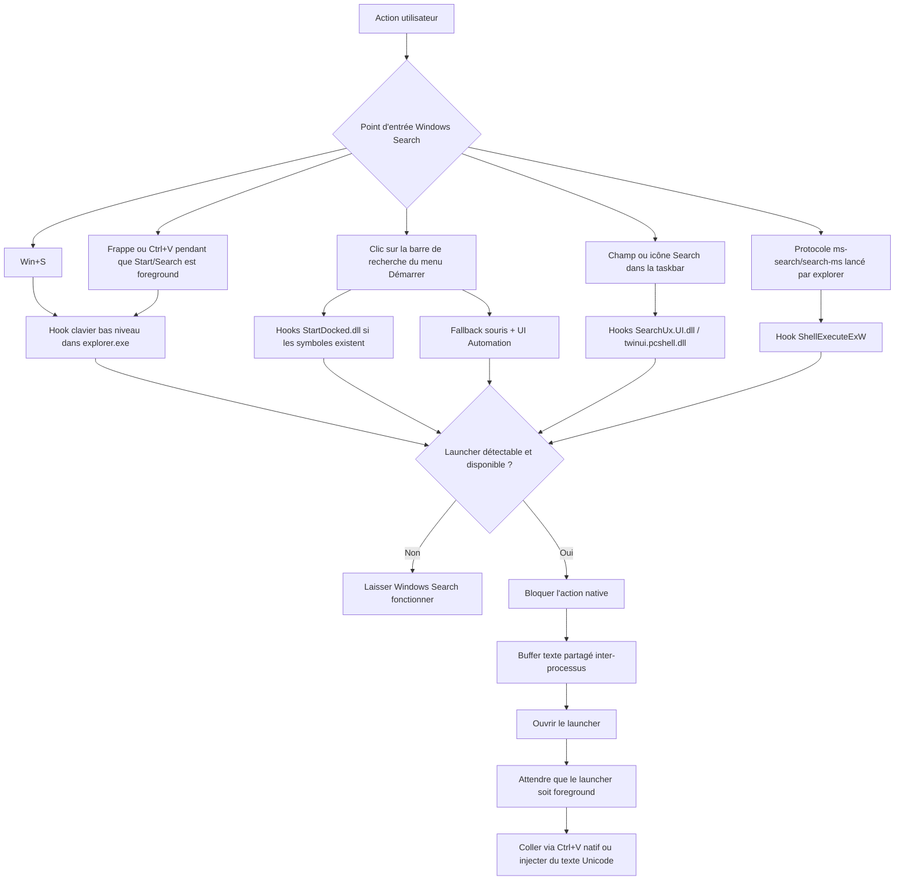
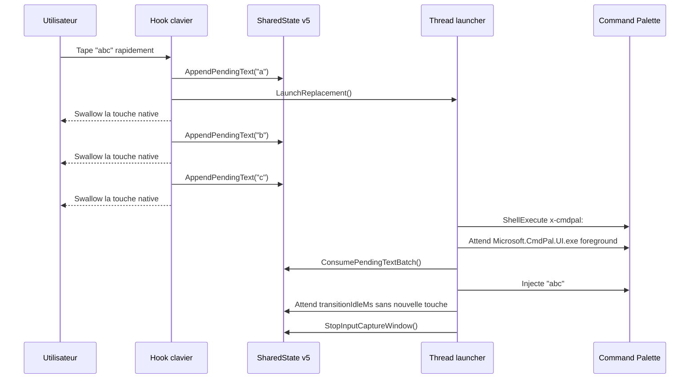
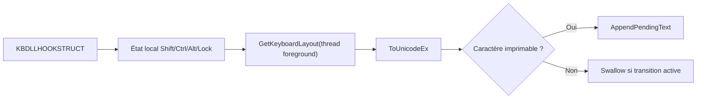
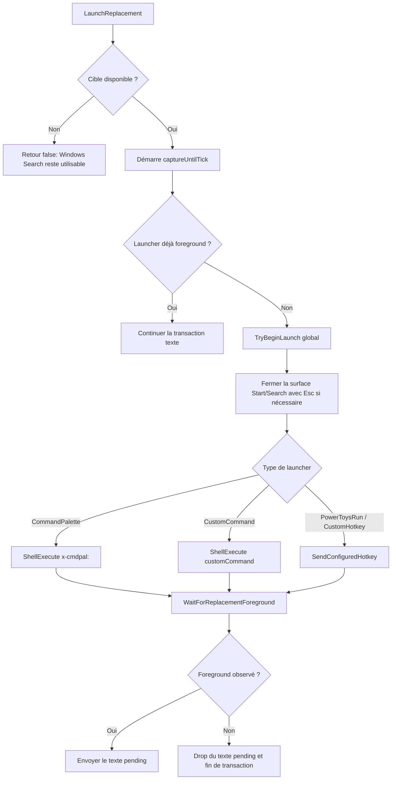

# Windows Search Redirector

> [English version](README.md) · Version française

Ce projet contient un mod Windhawk autonome qui remplace les points d'entrée de Windows Search par un launcher externe. La cible par défaut est PowerToys Command Palette via `x-cmdpal:`. Le mod capture aussi le texte tapé/collé pendant la transition afin d'éviter les caractères perdus ou envoyés dans la mauvaise fenêtre.

Le dossier historique `C:\Users\ferre\WindhawkToolchain` est désormais traité comme une archive en lecture seule. Les modifications doivent être faites dans ce dépôt.

## Arborescence

| Chemin | Rôle |
| --- | --- |
| `src/replace-windows-search.wh.cpp` | Source unique du mod Windhawk. |
| `tools/wh-tool.ps1` et `wh.cmd` | Toolchain CLI pour compiler, installer, recharger et lire les logs Windhawk. |
| `tools/dbwin-listener.cpp` | Source du listener `OutputDebugString`. |
| `tools/bin/dbwin-listener.exe` | Binaire local du listener de logs. |
| `tests/wh-test-input.cpp` | Harnais de test pour simuler les entrées Start/Search. |
| `tests/bin/wh-test-input.exe` | Binaire local du harnais de test. |
| `docs/windhawk-doc.md` | Export local de la documentation Windhawk utilisée pendant le développement. |
| `docs/external-review.md` | Review externe reçue, conservée comme contexte de maintenance. |

## Vue D'ensemble



Le mod est injecté dans trois processus:

| Processus | Responsabilité |
| --- | --- |
| `explorer.exe` | Coordination principale, hooks clavier/souris globaux, hook protocole Search, fallback UIA, hooks `twinui.pcshell.dll` quand disponible. |
| `StartMenuExperienceHost.exe` | Hooks `StartDocked.dll` pour les transitions de l'UI Start vers Search. |
| `SearchHost.exe` | Hooks `SearchUx.UI.dll` pour les chemins taskbar/SearchHost. |

## Matrice Des Hooks

| Chemin utilisateur | Hook principal | Fallback | Comportement |
| --- | --- | --- | --- |
| `Win+S` | `WH_KEYBOARD_LL` | Aucun | La touche `S` est swallow et le launcher est ouvert. |
| Taper dans le menu Démarrer ouvert | `WH_KEYBOARD_LL` si Start/Search est foreground | Fenêtre de capture transactionnelle | Les caractères sont bufferisés jusqu'à ce que le launcher soit prêt. |
| `Ctrl+V` dans Start/Search | `WH_KEYBOARD_LL` + lecture clipboard bornée | Injection Unicode si le clipboard a été normalisé | Le paste natif Windows Search est bloqué. |
| Clic barre de recherche Start | Hooks XAML `StartDocked.dll` | `WH_MOUSE_LL` + UI Automation sémantique | Le clic est swallow si le launcher est disponible. |
| Search taskbar | `SearchUx.UI.dll` | `twinui.pcshell.dll` selon le chemin Windows | L'ouverture native de Search est annulée. |
| Protocoles `ms-search:` / `search-ms:` | `ShellExecuteExW` dans explorer | Aucun hook global hors processus injectés | La requête est extraite puis le caller reçoit un succès simulé. |

Les hooks symboles Windows sont fragiles par nature: les PDB changent selon les builds. Les hooks qui dépendent de symboles privés sont donc traités comme opportunistes, et les chemins clavier/UIA restent nécessaires.

## Transaction De Texte



L'état partagé utilise:

| Élément | Rôle |
| --- | --- |
| Mapping `Local\Windhawk.ReplaceWindowsSearchWithApp.SharedState.v5` | Stocke le texte pending, l'état de lancement et les timestamps de capture. Le suffixe `vN` doit être incrémenté à chaque changement de layout de `SharedState`. |
| Mutex `Local\Windhawk.ReplaceWindowsSearchWithApp.SharedState.Mutex.v5` | Protège le buffer texte entre les processus et récupère proprement les locks abandonnés. |
| Champ `initialized` | Garantit qu'un seul processus zéro-initialise la mémoire partagée à la création. |
| `launchInProgress` | Évite que plusieurs processus ouvrent le launcher en même temps. |
| `captureUntilTick` | Définit la période pendant laquelle les touches sont swallow. |
| `pendingTextCanPasteOriginal` | Autorise un `Ctrl+V` natif seulement si le texte clipboard n'a pas été normalisé. |

Les `SharedStateLock` utilisés depuis les hooks bas niveau ont un timeout court (50 ms par défaut). Le thread launcher utilise un timeout plus long (500 ms) pour ne pas perdre de texte capturé.

## Clavier Et Texte

La capture respecte le layout clavier actif: le hook maintient un état local des modificateurs puis utilise `ToUnicodeEx` avec le layout du thread foreground. L'injection finale utilise `KEYEVENTF_UNICODE`, ce qui évite les erreurs AZERTY/QWERTY lors de l'envoi vers Command Palette.



Le clipboard et les queries protocoles sont normalisés en requête mono-ligne: retours ligne et tabulations deviennent des espaces, les caractères de contrôle sont supprimés, et la taille est bornée avant copie.

Limite connue: les dead keys composées peuvent rester imparfaites selon le layout, car le mod évite de muter l'état clavier global de `ToUnicodeEx`.

## Ouverture Du Launcher



Pour Command Palette, le chemin primaire est `x-cmdpal:`. Le hotkey `Win+Alt+Space` n'est jamais envoyé par défaut afin d'éviter d'ouvrir PowerToys Run. Un hotkey n'est utilisé que si `customHotkey` est explicitement configuré ou si le mode sélectionné est `PowerToys Run` / `Custom hotkey`.

En mode `Custom hotkey`, `customProcessName` est requis pour détecter le foreground et transférer du texte. En mode `Custom command`, il est également requis si la commande est une URI ou si le nom de processus ne peut pas être inféré depuis un `.exe`.

## Paramètres

| Paramètre | Défaut | Type UI | Effet |
| --- | --- | --- | --- |
| `launcher` | `commandPalette` | Combobox | Choisit Command Palette, PowerToys Run, custom hotkey ou custom command. Les anciennes valeurs `0`, `1`, `2`, `3` sont toujours acceptées. |
| `requireLauncherAvailable` | `true` | Toggle | Si activé, ne redirige que si le processus cible est déjà lancé. |
| `customProcessName` | vide | Texte | Processus utilisés pour availability/foreground, séparés par `,` ou `;`. |
| `customHotkey` | vide | Texte | Hotkey optionnel: `win+alt+space`, `ctrl+space`, `alt+space`, etc. |
| `customCommand` | vide | Texte | Exécutable, commande ou URI custom. |
| `customCommandArgs` | vide | Texte | Arguments pour un exécutable custom. Ignoré pour les URI. |
| `textCaptureDelayMs` | `180` | Nombre | Délai avant injection une fois le launcher foreground. Borné à 0-2000 ms. |
| `debounceMs` | `300` | Nombre | Anti double-lancement global. Borné à 0-5000 ms. |
| `transitionCaptureMs` | `3500` | Nombre | Fenêtre max de capture pendant l'ouverture. Bornée à 50-10000 ms. |
| `transitionIdleMs` | `80` | Nombre | Temps sans input avant fin de transaction. Borné à 0-1000 ms. |
| `redirectWinS` | `true` | Toggle | Redirige le raccourci `Win+S`. |
| `redirectStartMenuTyping` | `true` | Toggle | Redirige la frappe directe, le collage et backspace lorsque `StartMenuExperienceHost.exe` est foreground. |
| `redirectSearchHostTyping` | `true` | Toggle | Redirige la frappe directe, le collage et backspace lorsque `SearchHost.exe` est foreground. Désactive-le pour ne garder que la frappe dans le menu Démarrer. |
| `redirectStartMenuSearchBoxClick` | `true` | Toggle | Redirige les clics/taps sur la search box du Start, fallback UI Automation inclus. |
| `redirectStartMenuSearchTransitions` | `true` | Toggle | Redirige les requêtes privées StartDocked de focus/ouverture Search. |
| `redirectTaskbarSearch` | `true` | Toggle | Redirige le bouton Search de la taskbar et les hooks d'activation SearchHost. |
| `redirectUndockedSearch` | `true` | Toggle | Redirige les hooks twinui/Windows Search undocked. |
| `redirectSearchProtocol` | `true` | Toggle | Redirige les lancements `ms-search:`, `search-ms:` et `ms-searchassistant:`. |
| `allowInjectedInput` | `true` | Toggle | Autorise les outils de test à générer des touches synthétiques. |
| `log` | `false` | Toggle | Active les logs debug sans écrire le contenu tapé/collé. |

Tous les paramètres sont publiés via un snapshot atomique protégé par un `SRWLOCK`. Les toggles de redirection sont aussi reflétés dans des flags atomiques pour laisser passer rapidement les chemins désactivés depuis les hooks bas niveau. `Wh_ModSettingsChanged` reconstruit un snapshot complet, ce qui empêche les races sur les `std::wstring` lorsque les settings changent pendant que les hooks sont actifs.

Les toggles activent ou désactivent des couches de redirection, pas forcément l'installation physique des hooks. Les hooks peuvent rester installés pour permettre les changements de settings à chaud, mais les couches désactivées repassent vers le comportement Windows original.

Certains points d'entrée Windows Search sont couverts par plusieurs couches de fallback. Pour restaurer complètement un chemin natif, désactive à la fois le réglage spécifique et les couches plus larges comme `redirectUndockedSearch` ou `redirectSearchHostTyping` quand c'est pertinent. `redirectSearchHostTyping` ne contrôle que le texte tapé lorsque `SearchHost.exe` est déjà foreground, et reste indépendant de `redirectTaskbarSearch`.

## Toolchain

Depuis la racine du dépôt:

```powershell
.\wh.cmd status
.\wh.cmd build
.\wh.cmd install -EnableAfterBuild -DebugLogging
.\wh.cmd reload
.\wh.cmd logs -Tail 200
```

Listener `OutputDebugString`:

```powershell
.\tools\bin\dbwin-listener.exe .\logs\replace-search.log 10000
```

Tests rapides:

```powershell
.\tests\bin\wh-test-input.exe starttype AZERTY123
.\tests\bin\wh-test-input.exe startpaste "texte depuis clipboard"
.\tests\bin\wh-test-input.exe startclicksearch
.\tests\bin\wh-test-input.exe wins
```

## Maintenance

| Invariant | Raison |
| --- | --- |
| Le mod reste dans un seul fichier source Windhawk. | Windhawk distribue les mods comme un fichier C++ autonome. |
| Les paramètres sont toujours lus via `GetSettingsSnapshot()`. | Évite les data races sur les `std::wstring` lors d'un changement de settings. |
| Le hotkey Command Palette n'est pas envoyé par défaut. | `x-cmdpal:` est le chemin primaire et évite d'ouvrir PowerToys Run. |
| `LaunchReplacement()` retourne `true` si une transaction récente est déjà en cours. | Cela empêche Windows Search de passer entre deux frappes rapides. |
| `g_unloading` est posé sous `g_launchTrackingLock` dans `Wh_ModUninit()`. | Empêche `LaunchReplacement` ou `RequestReplacement` de créer un thread pendant le teardown, même en cas d'activation concurrente. |
| Incrémenter le suffixe `vN` du mapping/mutex partagé à chaque changement de layout de `SharedState`. | Évite que des versions différentes du mod dans plusieurs processus injectés voient des layouts incompatibles. |
| Les logs ne contiennent pas le texte capturé. | Le mod touche au clavier et au clipboard, donc les logs doivent rester non sensibles. |
| Les threads launcher sont attendus au unload. | Évite un use-after-free sur le shared state ou le code du module. |
