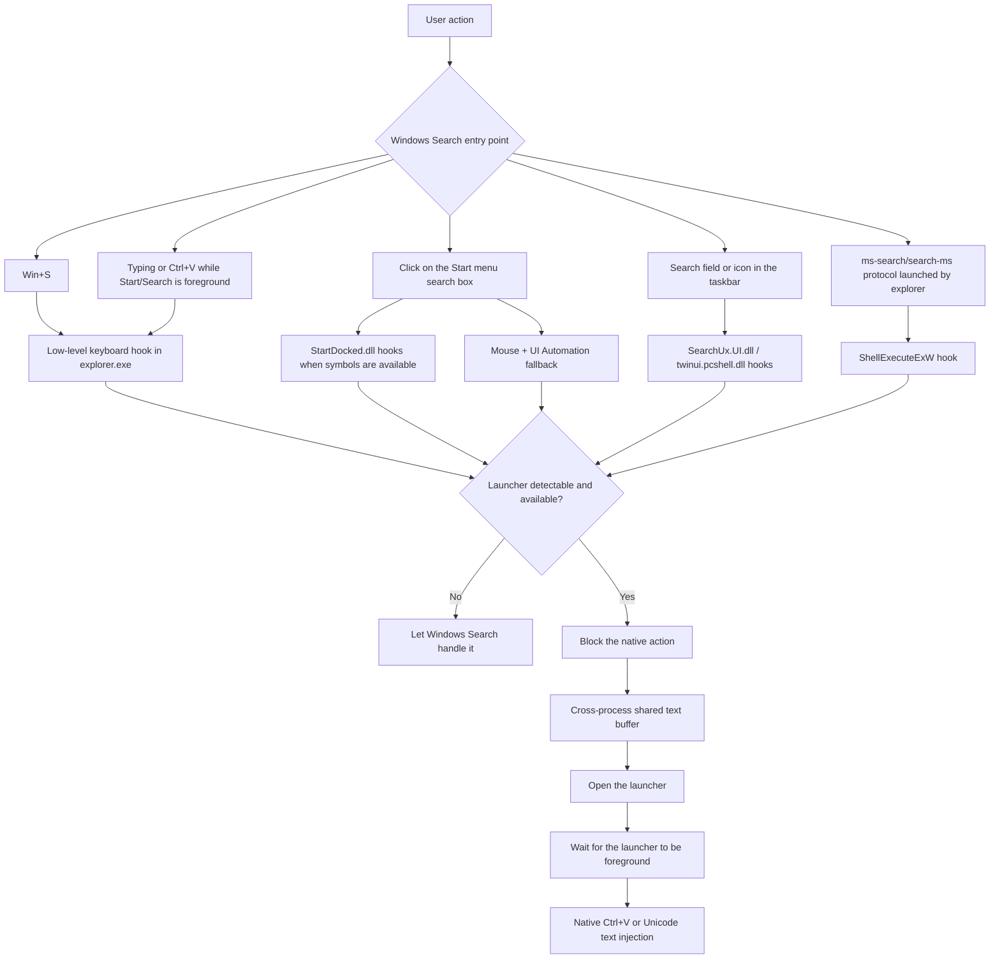
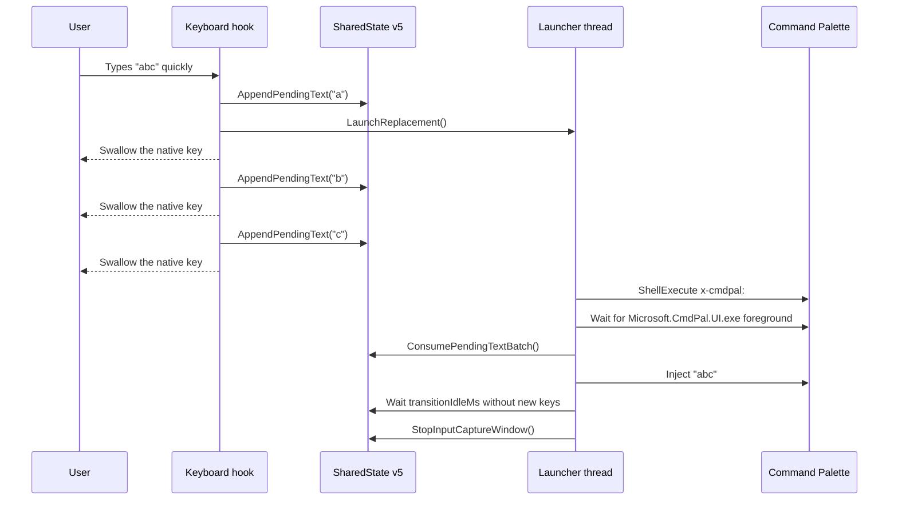
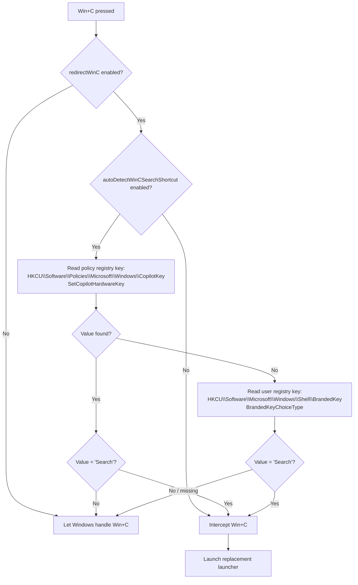
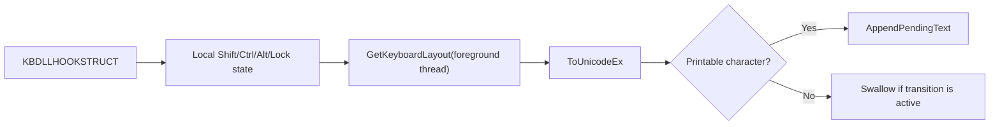
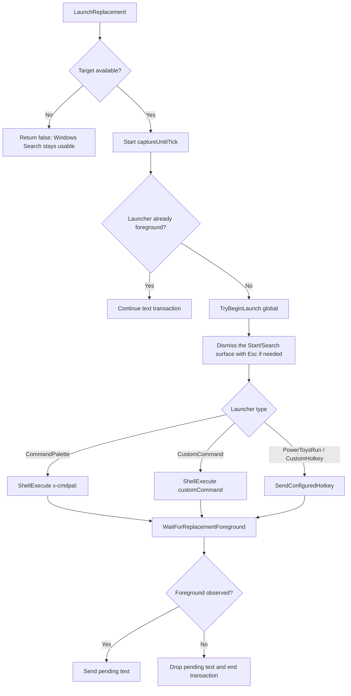

# Windows Search Redirector

> English version · [Version française](README.fr.md)

This project is a self-contained Windhawk mod that replaces the Windows Search entry points with an external launcher. The default target is PowerToys Command Palette via `x-cmdpal:`. The mod also captures text typed or pasted during the transition so characters are never lost or sent to the wrong window.

The legacy folder `C:\Users\ferre\WindhawkToolchain` is now treated as a read-only archive. Changes must happen in this repository.

## Layout

| Path | Purpose |
| --- | --- |
| `src/replace-windows-search.wh.cpp` | Single source file for the Windhawk mod. |
| `tools/wh-tool.ps1` and `wh.cmd` | CLI toolchain to compile, install, reload and read Windhawk logs. |
| `tools/dbwin-listener.cpp` | Source for the `OutputDebugString` listener. |
| `tools/bin/dbwin-listener.exe` | Local binary of the log listener. |
| `tests/wh-test-input.cpp` | Test harness used to simulate Start/Search input. |
| `tests/bin/wh-test-input.exe` | Local binary of the test harness. |
| `docs/windhawk-doc.md` | Local export of the Windhawk documentation referenced during development. |
| `docs/external-review.md` | External review kept as maintenance context. |

## Overview



The mod is injected into three processes:

| Process | Responsibility |
| --- | --- |
| `explorer.exe` | Main coordination, global keyboard/mouse hooks, Search protocol hook, UIA fallback, `twinui.pcshell.dll` hooks when available. |
| `StartMenuExperienceHost.exe` | `StartDocked.dll` hooks for Start UI to Search transitions. |
| `SearchHost.exe` | `SearchUx.UI.dll` hooks for the taskbar/SearchHost paths. |

## Hook Matrix

| User path | Primary hook | Fallback | Behavior |
| --- | --- | --- | --- |
| `Win+S` | `WH_KEYBOARD_LL` | None | The `S` key is swallowed and the launcher is opened. |
| Typing in the open Start menu | `WH_KEYBOARD_LL` while Start/Search is foreground | Transactional capture window | Characters are buffered until the launcher is ready. |
| `Ctrl+V` in Start/Search | `WH_KEYBOARD_LL` + bounded clipboard read | Unicode injection when the clipboard was normalized | The native Windows Search paste is blocked. |
| Click on the Start search bar | XAML hooks in `StartDocked.dll` | `WH_MOUSE_LL` + semantic UI Automation | The click is swallowed if the launcher is available. |
| Taskbar Search | `SearchUx.UI.dll` | `twinui.pcshell.dll` depending on the Windows path | The native Search activation is canceled. |
| `ms-search:` / `search-ms:` protocols | `ShellExecuteExW` in explorer | No hook outside the injected processes | The query is extracted and the caller receives a synthesized success. |

Windows symbol hooks are inherently fragile: the PDBs change between builds. Hooks that depend on private symbols are therefore opportunistic, and the keyboard/UIA paths remain mandatory.

## Text Transaction



## Win+C Detection

Redirection of `Win+C` is conditional: the mod first checks whether `Win+C` is currently configured to open Windows Search, then decides whether to intercept it or leave the native Windows behavior intact.



The shared state uses:

| Element | Role |
| --- | --- |
| Mapping `Local\Windhawk.ReplaceWindowsSearchWithApp.SharedState.v5` | Stores the pending text, launch state and capture timestamps. The `vN` suffix is bumped whenever `SharedState`'s layout changes. |
| Mutex `Local\Windhawk.ReplaceWindowsSearchWithApp.SharedState.Mutex.v5` | Protects the text buffer across processes and recovers cleanly from abandoned locks. |
| `initialized` field | Ensures only one process zero-initializes the shared memory at creation. |
| `launchInProgress` | Prevents multiple processes from opening the launcher concurrently. |
| `captureUntilTick` | Defines the period during which keys are swallowed. |
| `pendingTextCanPasteOriginal` | Allows a native `Ctrl+V` only when the clipboard text was not normalized. |

`SharedStateLock` instances used from low-level hooks have a short timeout (50 ms by default). The launcher thread uses a longer timeout (500 ms) so captured text is not silently dropped.

## Keyboard And Text

Capture respects the active keyboard layout: the hook keeps a local modifier state and uses `ToUnicodeEx` with the foreground thread's layout. The final injection uses `KEYEVENTF_UNICODE`, which avoids AZERTY/QWERTY mismatches when forwarding to Command Palette.



Clipboard content and protocol queries are normalized to a single-line query: line breaks and tabs become spaces, control characters are dropped, and the size is bounded before copy.

Known limit: composed dead keys can remain imperfect on certain layouts because the mod avoids mutating the global `ToUnicodeEx` keyboard state.

## Launcher Activation



For Command Palette, the primary path is `x-cmdpal:`. The `Win+Alt+Space` hotkey is never sent by default to avoid opening PowerToys Run instead. A hotkey is only used when `customHotkey` is explicitly configured or when the selected mode is `PowerToys Run` / `Custom hotkey`.

In `Custom hotkey` mode, `customProcessName` is required to detect the foreground and forward text. In `Custom command` mode it is also required when the command is a URI or when the process name cannot be inferred from a `.exe`.

## Settings

| Setting | Default | UI type | Effect |
| --- | --- | --- | --- |
| `launcher` | `commandPalette` | Combobox | Choose Command Palette, PowerToys Run, custom hotkey or custom command. The legacy values `0`, `1`, `2`, `3` are still accepted. |
| `requireLauncherAvailable` | `true` | Toggle | When enabled, only redirect if the target process is already running. |
| `customProcessName` | empty | Text | Process names for availability/foreground checks, separated by `,` or `;`. |
| `customHotkey` | empty | Text | Optional hotkey, e.g. `win+alt+space`, `ctrl+space`, `alt+space`. |
| `customCommand` | empty | Text | Custom executable, command or URI. |
| `customCommandArgs` | empty | Text | Arguments for a custom executable. Ignored for URI commands. |
| `textCaptureDelayMs` | `180` | Number | Delay before injection once the launcher reaches foreground. Clamped to 0-2000 ms. |
| `debounceMs` | `300` | Number | Global double-launch guard. Clamped to 0-5000 ms. |
| `transitionCaptureMs` | `3500` | Number | Maximum capture window during launcher activation. Clamped to 50-10000 ms. |
| `transitionIdleMs` | `80` | Number | Time without input before a transaction completes. Clamped to 0-1000 ms. |
| `redirectWinS` | `true` | Toggle | Redirect the `Win+S` shortcut. |
| `redirectWinQ` | `true` | Toggle | Redirect the `Win+Q` Search shortcut. |
| `redirectWinC` | `true` | Toggle | Redirect `Win+C` when it is configured to open Windows Search. |
| `autoDetectWinCSearchShortcut` | `true` | Toggle | Check `HKCU\Software\Microsoft\Windows\Shell\BrandedKey\BrandedKeyChoiceType` and only redirect `Win+C` when it is set to `Search`. Disable this to force `redirectWinC` manually. |
| `redirectStartMenuTyping` | `true` | Toggle | Redirect direct typing, paste and backspace while `StartMenuExperienceHost.exe` is foreground. |
| `redirectSearchHostTyping` | `true` | Toggle | Redirect direct typing, paste and backspace while `SearchHost.exe` is foreground. Disable this to keep only Start menu typing redirection. |
| `redirectStartMenuSearchBoxClick` | `true` | Toggle | Redirect clicks/taps on the Start menu search box, including UI Automation fallback. |
| `redirectStartMenuSearchTransitions` | `true` | Toggle | Redirect private StartDocked focus/open-search requests. |
| `redirectTaskbarSearch` | `true` | Toggle | Redirect taskbar Search button and SearchHost activation hooks. |
| `redirectUndockedSearch` | `true` | Toggle | Redirect twinui/undocked Windows Search activation hooks. |
| `redirectSearchProtocol` | `true` | Toggle | Redirect `ms-search:`, `search-ms:` and `ms-searchassistant:` launches. |
| `allowInjectedInput` | `true` | Toggle | Lets test tools generate synthetic keystrokes. |
| `log` | `false` | Toggle | Enable detailed debug logs (typed and pasted text are never logged). |

All settings are published through an atomic snapshot guarded by an `SRWLOCK`. Redirect toggles are also mirrored to atomic flags so disabled paths can pass through cheaply from low-level hooks. `Wh_ModSettingsChanged` rebuilds the full snapshot, which prevents `std::wstring` data races when settings change while hooks are active.

The redirect toggles enable or disable redirection layers, not necessarily the physical installation of hooks. Hooks may still be installed so settings can change at runtime, but disabled layers pass through to the original Windows behavior.

Some Windows Search entry points are covered by multiple fallback layers. To fully restore a native path, disable both the specific entry-point setting and broader fallback layers such as `redirectUndockedSearch` or `redirectSearchHostTyping` when applicable. `redirectSearchHostTyping` only controls text typed while `SearchHost.exe` is already foreground, and is independent from `redirectTaskbarSearch`.

`Win+C` auto-detection uses the Windows Copilot key/Win+C registry setting. `Win+Q` is a known Search shortcut and is controlled by its own toggle directly.

## Toolchain

From the repository root:

```powershell
.\wh.cmd status
.\wh.cmd build
.\wh.cmd install -EnableAfterBuild -DebugLogging
.\wh.cmd reload
.\wh.cmd logs -Tail 200
```

`OutputDebugString` listener:

```powershell
.\tools\bin\dbwin-listener.exe .\logs\replace-search.log 10000
```

Quick tests:

```powershell
.\tests\bin\wh-test-input.exe starttype AZERTY123
.\tests\bin\wh-test-input.exe startpaste "text from clipboard"
.\tests\bin\wh-test-input.exe startclicksearch
.\tests\bin\wh-test-input.exe wins
```

## Maintenance

| Invariant | Reason |
| --- | --- |
| The mod stays in a single Windhawk source file. | Windhawk distributes mods as a single self-contained C++ file. |
| Settings are always read through `GetSettingsSnapshot()`. | Avoids `std::wstring` data races when settings change while hooks run. |
| The Command Palette hotkey is not sent by default. | `x-cmdpal:` is the primary path and avoids opening PowerToys Run. |
| `LaunchReplacement()` returns `true` when a recent transaction is already in progress. | Prevents Windows Search from leaking through between rapid keystrokes. |
| `g_unloading` is set under `g_launchTrackingLock` in `Wh_ModUninit()`. | Stops `LaunchReplacement` and `RequestReplacement` from spawning a thread during teardown, even with concurrent activation. |
| Bump the `vN` suffix of the shared mapping/mutex when `SharedState`'s layout changes. | Different mod versions in concurrently injected processes must not see incompatible layouts. |
| Logs never contain captured text. | The mod touches the keyboard and clipboard, so logs must remain non-sensitive. |
| Launch threads are awaited on unload. | Avoids use-after-free on the shared state or module code. |
