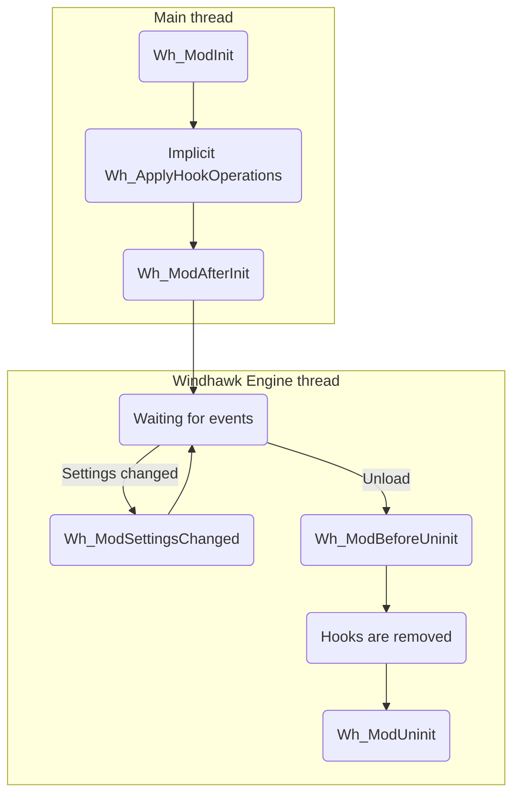

# ramensoftware/windhawk - Wiki Documentation

> Exported on: 01/05/2026

## Table of Contents

1. [Creating a new mod](#creating-a-new-mod)
2. [Home](#home)
3. [Command line flags](#command-line-flags)
4. [Creating a new mod](#creating-a-new-mod)
5. [Debugging the mods](#debugging-the-mods)
6. [Development tips](#development-tips)
7. [Editing mode guidelines](#editing-mode-guidelines)
8. [Injection targets and critical system processes](#injection-targets-and-critical-system-processes)
9. [Mod lifetime](#mod-lifetime)
10. [Mods as tools: Running mods in a dedicated process](#mods-as-tools:-running-mods-in-a-dedicated-process)
11. [Translations](#translations)
12. [Troubleshooting](#troubleshooting)

---

## Creating a new mod

# Creating a new mod

> Wiki page from: **ramensoftware/windhawk**


                Each mod is a single C++ file which is compiled into a dynamic library. After it's compiled, the mod is loaded by the Windhawk engine which calls the mod's callback functions and provides API functions that the mod can use.


The mod is loaded in the context of the processes that the mod targets. For example, if the mod targets Notepad, it will be loaded by the Windhawk engine in the context of each notepad.exe process.


In addition to the C++ code itself, the mod must provide information such as the mod id and name. Optionally, the mod may include a readme with information and settings to configure the mod.


To submit a mod to the official collection of Windhawk mods, refer to the readme in the [windhawk-mods](https://github.com/ramensoftware/windhawk-mods) repository.


## Mod metadata

[](#mod-metadata)
Each mod starts with a metadata block which contains information such as the mod id and name. The general format is:


```
// ==WindhawkMod==
// @key value
// ==/WindhawkMod==

```


    
      
    

      
    

    
  
Some keys may have multiple values, and some keys can be localized.


Metadata block example:


```
// ==WindhawkMod==
// @id              new-mod
// @name            Your Awesome Mod
// @description     The best mod ever that does great things
// @version         0.1
// @author          You
// @github          https://github.com/nat
// @twitter         https://twitter.com/jack
// @homepage        https://your-personal-homepage.example.com/
// @include         mspaint.exe
// @compilerOptions -lcomdlg32
// @license         MIT
// ==/WindhawkMod==

```


    
      
    

      
    

    
  

### @id

[](#id)

```
// @id mod-id-1

```


    
      
    

      
    

    
  
Each mod must have a unique mod id. The mod id must only contain the following characters: 0-9, a-z, and a hyphen (-).


### @name

[](#name)

```
// @name The mod name

```


    
      
    

      
    

    
  
The mod name. Can be localized (see below).


### @description

[](#description)

```
// @description The mod description

```


    
      
    

      
    

    
  
A short description of the mod. Can be localized (see below).


### @version

[](#version)

```
// @version 1.0

```


    
      
    

      
    

    
  
The mod version number. Must increase with each newly published mod version.


### @author

[](#author)

```
// @author John Doe

```


    
      
    

      
    

    
  
The mod author name or nickname. Can be localized (see below).


### @github

[](#github)

```
// @github https://github.com/nat

```


    
      
    

      
    

    
  
The link to the GitHub profile of the mod author.


### @twitter

[](#twitter)

```
// @twitter https://twitter.com/jack

```


    
      
    

      
    

    
  
The link to the Twitter profile of the mod author.


### @homepage

[](#homepage)

```
// @homepage https://your-personal-homepage.example.com/

```


    
      
    

      
    

    
  
The link to the website of the mod author.


### @donateUrl

[](#donateurl)

```
// @donateUrl https://your-personal-homepage.example.com/sponsor

```


    
      
    

      
    

    
  
The link to a web page where users can financially support or sponsor the mod author.


### @license

[](#license)

```
// @license MIT

```


    
      
    

      
    

    
  
The type of license under which the mod is released, specifying the terms for use, modification, and distribution.


### @include

[](#include)

```
// @include notepad.exe
// @include program-1.*.exe
// @include C:\programs\*.exe
// @include %SystemRoot%\explorer.exe

```


    
      
    

      
    

    
  
A list of executable file names/paths that the mod targets. For each process, the mod is loaded if the executable file path matches one of the `@include` entries and doesn't match any `@exclude` entry (see blow).


A wildcard can be used, where the `*` symbol matches any sequence of characters and `?` matches any single character.


Environment variables, such as `%SystemRoot%` and `%ProgramFiles%`, can be used. Note that `%ProgramFiles%` always refers to the native Program Files folder. `%ProgramFiles(X86)%` can be used to refer to the 32-bit Program Files folder (usually `C:\Program Files (x86)`).


There can be any number of `@include` entries.


### @exclude

[](#exclude)

```
// @exclude notepad.exe
// @exclude program-1.*.exe
// @exclude C:\programs\*.exe
// @exclude %SystemRoot%\explorer.exe

```


    
      
    

      
    

    
  
A list of executable file names/paths to be excluded from targeting. For each process, the mod is loaded if the executable file path matches one of the `@include` entries (see above) and doesn't match any `@exclude` entry.


A wildcard can be used, where the `*` symbol matches any sequence of characters and `?` matches any single character.


Environment variables, such as `%SystemRoot%` and `%ProgramFiles%`, can be used. Note that `%ProgramFiles%` always refers to the native Program Files folder. `%ProgramFiles(X86)%` can be used to refer to the 32-bit Program Files folder (usually `C:\Program Files (x86)`).


There can be any number of `@exclude` entries.


### @architecture

[](#architecture)

```
// @architecture x86
// @architecture x86-64
// @architecture amd64
// @architecture arm64

```


    
      
    

      
    

    
  
A list of supported architectures. Specifying no `@architecture` entries is equivalent to specifying both `x86` and `x86-64`.


Due to compatibility reasons, the names might be slightly misleading.


- **x86** - The mod is compiled as 32-bit (x86).
- **amd64** - The mod is compiled as 64-bit (x86-64).
- **arm64** - The mod is compiled as ARM64 (AArch64). Ignored on non-ARM64 devices.
- **x86-64** - On non-ARM64 devices, equivalent to **amd64**. On ARM64 devices: if the mod only targets processes from the predefined list below, equivalent to **arm64**. Otherwise, equivalent to specifying both **amd64** and **arm64**.

- The predefined list of processes: StartMenuExperienceHost.exe, SearchHost.exe, explorer.exe, ShellExperienceHost.exe, ShellHost.exe, dwm.exe, notepad.exe, regedit.exe.


There can be any number of `@architecture` entries.


### @compilerOptions

[](#compileroptions)

```
// @compilerOptions -lcomctl32 -lgdi32 -luxtheme

```


    
      
    

      
    

    
  
Extra command line parameters that are passed to the compiler when compiling the mod.


## Mod metadata localization

[](#mod-metadata-localization)
Some of the metadata entries can be localized for multiple languages, for example:


```
// @name       Example mod
// @name:uk-UA Приклад мод
// @name:fr-FR Exemple de mod

```


    
      
    

      
    

    
  

## Readme

[](#readme)
A mod may contain a readme block with information for the users. The general format is:


```
// ==WindhawkModReadme==
/*
content
*/
// ==/WindhawkModReadme==

```


    
      
    

      
    

    
  
[Markdown](https://en.wikipedia.org/wiki/Markdown) can be used to add links and formatting to the readme. Only images from the following domains can be embedded in the readme: `https://i.imgur.com`, `https://raw.githubusercontent.com`.


Readme example:


```
// ==WindhawkModReadme==
/*
# Your Awesome Mod
This is a place for useful information about your mod. Use it to describe
the mod, explain why it's useful, and add any other relevant details.
You can use [Markdown](https://en.wikipedia.org/wiki/Markdown) to add links
and **formatting** to the readme.
*/
// ==/WindhawkModReadme==

```


    
      
    

      
    

    
  

## Settings

[](#settings)
A mod may define settings that the mod users will be able to configure. The settings are defined in [YAML](https://en.wikipedia.org/wiki/YAML) format as following:


```
// ==WindhawkModSettings==
/*
- SettingName: Default Value
*/
// ==/WindhawkModSettings==

```


    
      
    

      
    

    
  
Each setting is defined by a name and a default value. The default value is set when the mod is installed, and can be changed later by the user.


Possible setting types are: boolean, number, string, array of numbers, array of strings.


Options can be nested as can be seen in the example below.


In addition to the setting name and default value, several metadata values can be used to make it easier for users to edit the options:


- `$name`: The name of the option.
- `$description`: A short description of the option.
- `$options`: Possible values for a string option, displayed to the user in a combobox.


The metadata values can be localized for multiple languages.


Settings example:


```
// ==WindhawkModSettings==
/*
- BooleanOption: true
  $name: Example Boolean
  $description: An example boolean setting
  $description:uk-UA: Приклад логічного налаштування
- NumberOption: 1234
- StringOption: Default string value
- StringCombobox: option1
  $options:
    - option1: First Option Description
    - option2: Second Option Description
  $options:uk-UA:
    - option1: Опис першого варіанту
    - option2: Опис другого варіанту
- NestedOptions:
    - NumberNestedOption: 2345
    - StringNestedOption: Nested option text
- ArrayOfNumbers: [1, 2, 3]
- ArrayOfStrings: [a, b, c]
- ArrayOfStringComboboxes: [a, b, c]
  $options:
    - a: First Option Description
    - b: Second Option Description
    - c: Third Option Description
- ArrayOfNestedOptions:
    - - NumberNestedOptionInArray: 3456
      - StringNestedOptionInArray: Nested option in array text
*/
// ==/WindhawkModSettings==

```


    
      
    

      
    

    
  

## Callback functions

[](#callback-functions)
There are several callback functions that the mod can implement. Those callback functions are called by the Windhawk engine when specific events occur.


See also: [Mod lifetime](/ramensoftware/windhawk/wiki/Mod-lifetime).


### Wh_ModInit

[](#wh_modinit)

```
BOOL Wh_ModInit()

```


    
      
    

      
    

    
  
The first callback function that is called by the Windhawk engine. Called before the target process starts executing, unless the process is already running when the mod is loading. Allows the mod to initialize and to set up hooks using the Wh_SetFunctionHook API function (see below).


The mod must return `TRUE` if initialization is successful. If `FALSE` is returned, no further callbacks are called and the mod is unloaded.


### Wh_ModAfterInit

[](#wh_modafterinit)

```
void Wh_ModAfterInit()

```


    
      
    

      
    

    
  
Called after `Wh_ModInit` and after the Windhawk engine completes setting up hooks.


### Wh_ModBeforeUninit

[](#wh_modbeforeuninit)

```
void Wh_ModBeforeUninit()

```


    
      
    

      
    

    
  
Called when the mod is about to be unloaded, before the Windhawk engine removes hooks.


### Wh_ModUninit

[](#wh_moduninit)

```
void Wh_ModUninit()

```


    
      
    

      
    

    
  
Called when the mod is about to be unloaded, after the Windhawk engine removes hooks.


### Wh_ModSettingsChanged

[](#wh_modsettingschanged)

```
// Variant 1:
void Wh_ModSettingsChanged()
// Variant 2:
BOOL Wh_ModSettingsChanged(BOOL* bReload)

```


    
      
    

      
    

    
  
Called when the mod settings are changed. Allows the mod to load and apply the new settings.


Variant 2 of the callback allows to unload or reload the mod after settings are changed. If the callback returns `FALSE`, the mod will be unloaded for the target process, and will stay unloaded until settings are changed again. If the callback returns `TRUE` and `*bReload` is set to `TRUE`, the mod will be reloaded after the callback returns.


## API functions

[](#api-functions)
There are several API functions that the mod can use.


### Wh_Log

[](#wh_log)

```
#define Wh_Log(message, ...) /*...*/

```


    
      
    

      
    

    
  
Logs a message. If logging is enabled, the message can be viewed in
the editor log output window. The arguments are only evaluated if logging
is enabled.


- `message`: The message to be logged. It can optionally contain embedded
printf-style format specifiers that are replaced by the values specified
in subsequent additional arguments and formatted as requested.


### Wh_GetIntValue

[](#wh_getintvalue)

```
int Wh_GetIntValue(PCWSTR valueName, int defaultValue);

```


    
      
    

      
    

    
  
Retrieves an integer value from the mod's local storage.


- `valueName`: The name of the value to retrieve.
- `defaultValue`: The default value to be returned as a fallback.


**Returns**: The retrieved integer value. If the value doesn't exist or in case of
an error, the provided default value is returned.


### Wh_SetIntValue

[](#wh_setintvalue)

```
BOOL Wh_SetIntValue(PCWSTR valueName, int value);

```


    
      
    

      
    

    
  
Stores an integer value in the mod's local storage.


- `valueName`: The name of the value to store.
- `value`: The value to store.


**Returns**: A boolean value indicating whether the function succeeded.


### Wh_GetStringValue

[](#wh_getstringvalue)

```
size_t Wh_GetStringValue(PCWSTR valueName, PWSTR stringBuffer, size_t bufferChars);

```


    
      
    

      
    

    
  
Retrieves a string value from the mod's local storage.


- `valueName`: The name of the value to retrieve.
- `stringBuffer`: The buffer that will receive the text, terminated with a
null character.
- `bufferChars`: The length of `stringBuffer`, in characters. The buffer
must be large enough to include the terminating null character.


**Returns**: The number of characters copied to the buffer, not including the
terminating null character. If the value doesn't exist, if the buffer is
not large enough, or in case of an error, an empty string is returned.


### Wh_SetStringValue

[](#wh_setstringvalue)

```
BOOL Wh_SetStringValue(PCWSTR valueName, PCWSTR value);

```


    
      
    

      
    

    
  
Stores a string value in the mod's local storage.


- `valueName`: The name of the value to store.
- `value`: A null-terminated string containing the value to store.


**Returns**: A boolean value indicating whether the function succeeded.


### Wh_GetBinaryValue

[](#wh_getbinaryvalue)

```
size_t Wh_GetBinaryValue(PCWSTR valueName, void* buffer, size_t bufferSize);

```


    
      
    

      
    

    
  
Retrieves a binary value (raw bytes) from the mod's local storage.


- `valueName`: The name of the value to retrieve.
- `buffer`: The buffer that will receive the value.
- `bufferSize`: The length of the buffer, in bytes.


**Returns**: The number of bytes copied to the buffer. If the value doesn't exist,
if the buffer is not large enough, or in case of an error, no data is
copied and the return value is zero.


### Wh_SetBinaryValue

[](#wh_setbinaryvalue)

```
BOOL Wh_SetBinaryValue(PCWSTR valueName, const void* buffer, size_t bufferSize);

```


    
      
    

      
    

    
  
Stores a binary value (raw bytes) in the mod's local storage.


- `valueName`: The name of the value to store.
- `buffer`: An array of bytes containing the value to store.
- `bufferSize`: The size of the array of bytes.


**Returns**: A boolean value indicating whether the function succeeded.


### Wh_DeleteValue

[](#wh_deletevalue)

```
BOOL Wh_DeleteValue(PCWSTR valueName);

```


    
      
    

      
    

    
  
Deletes a value from the mod's local storage.


- `valueName`: The name of the value to delete.


**Returns**: A boolean value indicating whether the function succeeded.


### Wh_GetModStoragePath

[](#wh_getmodstoragepath)

```
size_t Wh_GetModStoragePath(PWSTR pathBuffer, size_t bufferChars);

```


    
      
    

      
    

    
  
Retrieves the mod's storage directory path. The directory can be used by the mod
to store any necessary files. The directory will be removed when the mod is
removed.


- `pathBuffer`: The buffer that will receive the path, terminated with a null
character.
- `bufferChars`: The length of `pathBuffer`, in characters. The buffer must be
large enough to include the terminating null character.


**Returns**: The number of characters copied to the buffer, not including the
terminating null character. If the buffer is not large enough or in case of an
error, an empty string is returned.


### Wh_GetIntSetting

[](#wh_getintsetting)

```
int Wh_GetIntSetting(PCWSTR valueName, ...);

```


    
      
    

      
    

    
  
Retrieves an integer value from the mod's user settings.


- `valueName`: The name of the value to retrieve. It can optionally contain
embedded printf-style format specifiers that are replaced by the values
specified in subsequent additional arguments and formatted as requested.


**Returns**: The retrieved integer value. If the value doesn't exist or in case of
an error, the return value is zero.


### Wh_GetStringSetting

[](#wh_getstringsetting)

```
PCWSTR Wh_GetStringSetting(PCWSTR valueName, ...);

```


    
      
    

      
    

    
  
Retrieves a string value from the mod's user settings. When no longer
needed, free the memory with `Wh_FreeStringSetting`.


- `valueName`: The name of the value to retrieve. It can optionally contain
embedded printf-style format specifiers that are replaced by the values
specified in subsequent additional arguments and formatted as requested.


**Returns**: The retrieved string value. If the value doesn't exist or in case of
an error, an empty string is returned.


### Wh_FreeStringSetting

[](#wh_freestringsetting)

```
void Wh_FreeStringSetting(PCWSTR string);

```


    
      
    

      
    

    
  
Frees a string returned by `Wh_GetStringSetting`.


- `string`: The string to free.


### Wh_SetFunctionHook

[](#wh_setfunctionhook)

```
BOOL Wh_SetFunctionHook(void* targetFunction, void* hookFunction, void** originalFunction);

```


    
      
    

      
    

    
  
Registers a hook for the specified target function. Can't be called
after `Wh_ModBeforeUninit` returns. Registered hook operations can be
applied with `Wh_ApplyHookOperations`.


- `targetFunction`: A pointer to the target function, which will be
overridden by the detour function.
- `hookFunction`: A pointer to the detour function, which will override the
target function.
- `originalFunction`: A pointer to the trampoline function, which will be
used to call the original target function. Can be `NULL`.


**Returns**: A boolean value indicating whether the function succeeded.


### Wh_RemoveFunctionHook

[](#wh_removefunctionhook)

```
BOOL Wh_RemoveFunctionHook(void* targetFunction);

```


    
      
    

      
    

    
  
Registers a hook to be removed for the specified target function.
Can't be called before `Wh_ModInit` returns or after `Wh_ModBeforeUninit`
returns. Registered hook operations can be applied with
`Wh_ApplyHookOperations`.


- `targetFunction`: A pointer to the target function, for which the hook
will be removed.


**Returns**: A boolean value indicating whether the function succeeded.


### Wh_ApplyHookOperations

[](#wh_applyhookoperations)

```
BOOL Wh_ApplyHookOperations();

```


    
      
    

      
    

    
  
Applies hook operations registered by `Wh_SetFunctionHook` and
`Wh_RemoveFunctionHook`. Called automatically by Windhawk after
`Wh_ModInit`. Can't be called before `Wh_ModInit` returns or after
`Wh_ModBeforeUninit` returns. Note: This function is very slow, avoid
using it if possible. Ideally, all hooks should be set in `Wh_ModInit`
and this function should never be used.


**Returns**: A boolean value indicating whether the function succeeded.


### Wh_FindFirstSymbol

[](#wh_findfirstsymbol)

```
typedef struct tagWH_FIND_SYMBOL_OPTIONS {
    // Must be set to `sizeof(WH_FIND_SYMBOL_OPTIONS)`.
    size_t optionsSize;
    // The symbol server to query. Set to `NULL` to query the Microsoft public
    // symbol server.
    PCWSTR symbolServer;
    // Set to `TRUE` to only retrieve decorated symbols, making the enumeration
    // faster. Can be especially useful for very large modules such as Chrome or
    // Firefox.
    BOOL noUndecoratedSymbols;
} WH_FIND_SYMBOL_OPTIONS;

typedef struct tagWH_FIND_SYMBOL {
    void* address;
    PCWSTR symbol;
    PCWSTR symbolDecorated;
} WH_FIND_SYMBOL;

HANDLE Wh_FindFirstSymbol(HMODULE hModule, const WH_FIND_SYMBOL_OPTIONS* options, WH_FIND_SYMBOL* findData);

```


    
      
    

      
    

    
  
Returns information about the first symbol for the specified module
handle.


- `hModule`: A handle to the loaded module whose information is being
requested. If this parameter is `NULL`, the module of the current process
(.exe file) is used.
- `options`: Can be used to customize the symbol enumeration. Pass `NULL`
to use the default options.
- `findData`: A pointer to a structure to receive the symbol information.


**Returns**: A search handle used in a subsequent call to `Wh_FindNextSymbol` or
`Wh_FindCloseSymbol`. If no symbols are found or in case of an error, the
return value is `NULL`.


### Wh_FindNextSymbol

[](#wh_findnextsymbol)

```
typedef struct tagWH_FIND_SYMBOL {
    void* address;
    PCWSTR symbol;
    PCWSTR symbolDecorated;
} WH_FIND_SYMBOL;

BOOL Wh_FindNextSymbol(HANDLE symSearch, WH_FIND_SYMBOL* findData);

```


    
      
    

      
    

    
  
Returns information about the next symbol for the specified search
handle, continuing an enumeration from a previous call to
`Wh_FindFirstSymbol`.


- `symSearch`: A search handle returned by a previous call to
`Wh_FindFirstSymbol`.
- `findData`: A pointer to a structure to receive the symbol information.


**Returns**: A boolean value indicating whether symbol information was retrieved.
If no more symbols are found or in case of an error, the return value is
`FALSE`.


### Wh_FindCloseSymbol

[](#wh_findclosesymbol)

```
void Wh_FindCloseSymbol(HANDLE symSearch);

```


    
      
    

      
    

    
  
Closes a file search handle opened by `Wh_FindFirstSymbol`.


- `symSearch`: The search handle. If symSearch is `NULL`, the function does
nothing.


### Wh_Disasm

[](#wh_disasm)

```
typedef struct tagWH_DISASM_RESULT {
    // The length of the decoded instruction.
    size_t length;
    // The textual, human-readable representation of the instruction.
    char text[96];
} WH_DISASM_RESULT;

BOOL Wh_Disasm(void* address, WH_DISASM_RESULT* result);

```


    
      
    

      
    

    
  
Disassembles an instruction and formats it to human-readable text.


- `address`: The address of the instruction to disassemble.
- `result`: A pointer to a structure to receive the disassembly
information.


**Returns**: A boolean value indicating whether the function succeeded.


### Wh_GetUrlContent

[](#wh_geturlcontent)

```
typedef struct tagWH_GET_URL_CONTENT_OPTIONS {
    // Must be set to `sizeof(WH_GET_URL_CONTENT_OPTIONS)`.
    size_t optionsSize;
    // The path to the file to which the content will be written. If set, the
    // data will be written to the file and the `data` field of the returned
    // struct will be `NULL`. If this field is `NULL`, the content will be
    // returned in the `data` field.
    PCWSTR targetFilePath;
} WH_GET_URL_CONTENT_OPTIONS;

typedef struct tagWH_URL_CONTENT {
    const char* data;
    size_t length;
    int statusCode;
} WH_URL_CONTENT;

const WH_URL_CONTENT* Wh_GetUrlContent(
    PCWSTR url,
    const WH_GET_URL_CONTENT_OPTIONS* options);

```


    
      
    

      
    

    
  
Retrieves the content of a URL. When no longer needed, call
`Wh_FreeUrlContent` to free the content.


- `url`: The URL to retrieve.
- `options`: The options for the URL content retrieval. Pass `NULL` to use the
default options.


**Returns**: The retrieved content. In case of an error, `NULL` is returned.


### Wh_FreeUrlContent

[](#wh_freeurlcontent)

```
void Wh_FreeUrlContent(const WH_URL_CONTENT* content);

```


    
      
    

      
    

    
  
Frees the content of a URL returned by `Wh_GetUrlContent`.


- `content`: The content to free. If `NULL`, the function does nothing.


## Constants

[](#constants)
There are several defined constants that can be used in the code.


### WH_MOD_ID

[](#wh_mod_id)
The mod id. Example: `L"my-mod"`


### WH_MOD_VERSION

[](#wh_mod_version)
The mod version. Example: `L"1.0"`


## Compilation

[](#compilation)
As of version 1.7, Windhawk uses Clang 20 ([mingw-w64 toolchain](https://github.com/mstorsjo/llvm-mingw)) and compiles the mods in C++23 mode. The full command line parameters can be seen in editing mode by clicking Ctrl+P and selecting `compile_flags.txt`.


              

---

## Home

Welcome to the Windhawk wiki!

Windhawk aims to make it easier to customize Windows programs. For more details, see [the official website](https://windhawk.net/) and [the announcement](https://ramensoftware.com/windhawk).

---

## Command line flags

One question that comes up a lot is how to run Windhawk without opening the main
window. This is possible with the `-tray-only` flag, as following:

```
windhawk.exe -tray-only
```

Other command-line flags that may be useful:

```
windhawk.exe -exit [-wait]
windhawk.exe -restart [-tray-only]
windhawk.exe -safe-mode
```

---

## Creating a new mod

Each mod is a single C++ file which is compiled into a dynamic library. After it's compiled, the mod is loaded by the Windhawk engine which calls the mod's callback functions and provides API functions that the mod can use.

The mod is loaded in the context of the processes that the mod targets. For example, if the mod targets Notepad, it will be loaded by the Windhawk engine in the context of each notepad.exe process.

In addition to the C++ code itself, the mod must provide information such as the mod id and name. Optionally, the mod may include a readme with information and settings to configure the mod.

To submit a mod to the official collection of Windhawk mods, refer to the readme in the [windhawk-mods](https://github.com/ramensoftware/windhawk-mods) repository.

## Mod metadata

Each mod starts with a metadata block which contains information such as the mod id and name. The general format is:

```
// ==WindhawkMod==
// @key value
// ==/WindhawkMod==
```

Some keys may have multiple values, and some keys can be localized.

Metadata block example:

```
// ==WindhawkMod==
// @id              new-mod
// @name            Your Awesome Mod
// @description     The best mod ever that does great things
// @version         0.1
// @author          You
// @github          https://github.com/nat
// @twitter         https://twitter.com/jack
// @homepage        https://your-personal-homepage.example.com/
// @include         mspaint.exe
// @compilerOptions -lcomdlg32
// @license         MIT
// ==/WindhawkMod==
```

### @id

```
// @id mod-id-1
```

Each mod must have a unique mod id. The mod id must only contain the following characters: 0-9, a-z, and a hyphen (-).

### @name

```
// @name The mod name
```

The mod name. Can be localized (see below).

### @description

```
// @description The mod description
```

A short description of the mod. Can be localized (see below).

### @version

```
// @version 1.0
```

The mod version number. Must increase with each newly published mod version.

### @author

```
// @author John Doe
```

The mod author name or nickname. Can be localized (see below).

### @github

```
// @github https://github.com/nat
```

The link to the GitHub profile of the mod author.

### @twitter

```
// @twitter https://twitter.com/jack
```

The link to the Twitter profile of the mod author.

### @homepage

```
// @homepage https://your-personal-homepage.example.com/
```

The link to the website of the mod author.

### @donateUrl

```
// @donateUrl https://your-personal-homepage.example.com/sponsor
```

The link to a web page where users can financially support or sponsor the mod author.

### @license

```
// @license MIT
```

The type of license under which the mod is released, specifying the terms for use, modification, and distribution.

### @include

```
// @include notepad.exe
// @include program-1.*.exe
// @include C:\programs\*.exe
// @include %SystemRoot%\explorer.exe
```

A list of executable file names/paths that the mod targets. For each process, the mod is loaded if the executable file path matches one of the `@include` entries and doesn't match any `@exclude` entry (see blow).

A wildcard can be used, where the `*` symbol matches any sequence of characters and `?` matches any single character.

Environment variables, such as `%SystemRoot%` and `%ProgramFiles%`, can be used. Note that `%ProgramFiles%` always refers to the native Program Files folder. `%ProgramFiles(X86)%` can be used to refer to the 32-bit Program Files folder (usually `C:\Program Files (x86)`).

There can be any number of `@include` entries.

### @exclude

```
// @exclude notepad.exe
// @exclude program-1.*.exe
// @exclude C:\programs\*.exe
// @exclude %SystemRoot%\explorer.exe
```

A list of executable file names/paths to be excluded from targeting. For each process, the mod is loaded if the executable file path matches one of the `@include` entries (see above) and doesn't match any `@exclude` entry.

A wildcard can be used, where the `*` symbol matches any sequence of characters and `?` matches any single character.

Environment variables, such as `%SystemRoot%` and `%ProgramFiles%`, can be used. Note that `%ProgramFiles%` always refers to the native Program Files folder. `%ProgramFiles(X86)%` can be used to refer to the 32-bit Program Files folder (usually `C:\Program Files (x86)`).

There can be any number of `@exclude` entries.

### @architecture

```
// @architecture x86
// @architecture x86-64
// @architecture amd64
// @architecture arm64
```

A list of supported architectures. Specifying no `@architecture` entries is equivalent to specifying both `x86` and `x86-64`.

Due to compatibility reasons, the names might be slightly misleading.

* **x86** - The mod is compiled as 32-bit (x86).
* **amd64** - The mod is compiled as 64-bit (x86-64).
* **arm64** - The mod is compiled as ARM64 (AArch64). Ignored on non-ARM64 devices.
* **x86-64** - On non-ARM64 devices, equivalent to **amd64**. On ARM64 devices: if the mod only targets processes from the predefined list below, equivalent to **arm64**. Otherwise, equivalent to specifying both **amd64** and **arm64**.
  * The predefined list of processes: StartMenuExperienceHost.exe, SearchHost.exe, explorer.exe, ShellExperienceHost.exe, ShellHost.exe, dwm.exe, notepad.exe, regedit.exe.

There can be any number of `@architecture` entries.

### @compilerOptions

```
// @compilerOptions -lcomctl32 -lgdi32 -luxtheme
```

Extra command line parameters that are passed to the compiler when compiling the mod.

## Mod metadata localization

Some of the metadata entries can be localized for multiple languages, for example:

```
// @name       Example mod
// @name:uk-UA Приклад мод
// @name:fr-FR Exemple de mod
```

## Readme

A mod may contain a readme block with information for the users. The general format is:

```
// ==WindhawkModReadme==
/*
content
*/
// ==/WindhawkModReadme==
```

[Markdown](https://en.wikipedia.org/wiki/Markdown) can be used to add links and formatting to the readme. Only images from the following domains can be embedded in the readme: `https://i.imgur.com`, `https://raw.githubusercontent.com`.

Readme example:

```
// ==WindhawkModReadme==
/*
# Your Awesome Mod
This is a place for useful information about your mod. Use it to describe
the mod, explain why it's useful, and add any other relevant details.
You can use [Markdown](https://en.wikipedia.org/wiki/Markdown) to add links
and **formatting** to the readme.
*/
// ==/WindhawkModReadme==
```

## Settings

A mod may define settings that the mod users will be able to configure. The settings are defined in [YAML](https://en.wikipedia.org/wiki/YAML) format as following:

```
// ==WindhawkModSettings==
/*
- SettingName: Default Value
*/
// ==/WindhawkModSettings==
```

Each setting is defined by a name and a default value. The default value is set when the mod is installed, and can be changed later by the user.

Possible setting types are: boolean, number, string, array of numbers, array of strings.

Options can be nested as can be seen in the example below.

In addition to the setting name and default value, several metadata values can be used to make it easier for users to edit the options:
* `$name`: The name of the option.
* `$description`: A short description of the option.
* `$options`: Possible values for a string option, displayed to the user in a combobox.

The metadata values can be localized for multiple languages.

Settings example:

```
// ==WindhawkModSettings==
/*
- BooleanOption: true
  $name: Example Boolean
  $description: An example boolean setting
  $description:uk-UA: Приклад логічного налаштування
- NumberOption: 1234
- StringOption: Default string value
- StringCombobox: option1
  $options:
    - option1: First Option Description
    - option2: Second Option Description
  $options:uk-UA:
    - option1: Опис першого варіанту
    - option2: Опис другого варіанту
- NestedOptions:
    - NumberNestedOption: 2345
    - StringNestedOption: Nested option text
- ArrayOfNumbers: [1, 2, 3]
- ArrayOfStrings: [a, b, c]
- ArrayOfStringComboboxes: [a, b, c]
  $options:
    - a: First Option Description
    - b: Second Option Description
    - c: Third Option Description
- ArrayOfNestedOptions:
    - - NumberNestedOptionInArray: 3456
      - StringNestedOptionInArray: Nested option in array text
*/
// ==/WindhawkModSettings==
```

## Callback functions

There are several callback functions that the mod can implement. Those callback functions are called by the Windhawk engine when specific events occur.

See also: [[Mod lifetime|Mod-lifetime]].

### `Wh_ModInit`

```
BOOL Wh_ModInit()
```

The first callback function that is called by the Windhawk engine. Called before the target process starts executing, unless the process is already running when the mod is loading. Allows the mod to initialize and to set up hooks using the Wh_SetFunctionHook API function (see below).

The mod must return `TRUE` if initialization is successful. If `FALSE` is returned, no further callbacks are called and the mod is unloaded.

### `Wh_ModAfterInit`

```
void Wh_ModAfterInit()
```

Called after `Wh_ModInit` and after the Windhawk engine completes setting up hooks.

### `Wh_ModBeforeUninit`

```
void Wh_ModBeforeUninit()
```

Called when the mod is about to be unloaded, before the Windhawk engine removes hooks.

### `Wh_ModUninit`

```
void Wh_ModUninit()
```

Called when the mod is about to be unloaded, after the Windhawk engine removes hooks.

### `Wh_ModSettingsChanged`

```
// Variant 1:
void Wh_ModSettingsChanged()
// Variant 2:
BOOL Wh_ModSettingsChanged(BOOL* bReload)
```

Called when the mod settings are changed. Allows the mod to load and apply the new settings.

Variant 2 of the callback allows to unload or reload the mod after settings are changed. If the callback returns `FALSE`, the mod will be unloaded for the target process, and will stay unloaded until settings are changed again. If the callback returns `TRUE` and `*bReload` is set to `TRUE`, the mod will be reloaded after the callback returns.

## API functions

There are several API functions that the mod can use.

### `Wh_Log`

```
#define Wh_Log(message, ...) /*...*/
```

Logs a message. If logging is enabled, the message can be viewed in
the editor log output window. The arguments are only evaluated if logging
is enabled.

* `message`: The message to be logged. It can optionally contain embedded
printf-style format specifiers that are replaced by the values specified
in subsequent additional arguments and formatted as requested.

### `Wh_GetIntValue`

```
int Wh_GetIntValue(PCWSTR valueName, int defaultValue);
```

Retrieves an integer value from the mod's local storage.

* `valueName`: The name of the value to retrieve.
* `defaultValue`: The default value to be returned as a fallback.

**Returns**: The retrieved integer value. If the value doesn't exist or in case of
an error, the provided default value is returned.

### `Wh_SetIntValue`

```
BOOL Wh_SetIntValue(PCWSTR valueName, int value);
```

Stores an integer value in the mod's local storage.

* `valueName`: The name of the value to store.
* `value`: The value to store.

**Returns**: A boolean value indicating whether the function succeeded.

### `Wh_GetStringValue`

```
size_t Wh_GetStringValue(PCWSTR valueName, PWSTR stringBuffer, size_t bufferChars);
```

Retrieves a string value from the mod's local storage.

* `valueName`: The name of the value to retrieve.
* `stringBuffer`: The buffer that will receive the text, terminated with a
null character.
* `bufferChars`: The length of `stringBuffer`, in characters. The buffer
must be large enough to include the terminating null character.

**Returns**: The number of characters copied to the buffer, not including the
terminating null character. If the value doesn't exist, if the buffer is
not large enough, or in case of an error, an empty string is returned.

### `Wh_SetStringValue`

```
BOOL Wh_SetStringValue(PCWSTR valueName, PCWSTR value);
```

Stores a string value in the mod's local storage.

* `valueName`: The name of the value to store.
* `value`: A null-terminated string containing the value to store.

**Returns**: A boolean value indicating whether the function succeeded.

### `Wh_GetBinaryValue`

```
size_t Wh_GetBinaryValue(PCWSTR valueName, void* buffer, size_t bufferSize);
```

Retrieves a binary value (raw bytes) from the mod's local storage.

* `valueName`: The name of the value to retrieve.
* `buffer`: The buffer that will receive the value.
* `bufferSize`: The length of the buffer, in bytes.

**Returns**: The number of bytes copied to the buffer. If the value doesn't exist,
if the buffer is not large enough, or in case of an error, no data is
copied and the return value is zero.

### `Wh_SetBinaryValue`

```
BOOL Wh_SetBinaryValue(PCWSTR valueName, const void* buffer, size_t bufferSize);
```

Stores a binary value (raw bytes) in the mod's local storage.

* `valueName`: The name of the value to store.
* `buffer`: An array of bytes containing the value to store.
* `bufferSize`: The size of the array of bytes.

**Returns**: A boolean value indicating whether the function succeeded.

### `Wh_DeleteValue`

```
BOOL Wh_DeleteValue(PCWSTR valueName);
```

Deletes a value from the mod's local storage.

* `valueName`: The name of the value to delete.

**Returns**: A boolean value indicating whether the function succeeded.

### `Wh_GetModStoragePath`

```
size_t Wh_GetModStoragePath(PWSTR pathBuffer, size_t bufferChars);
```

Retrieves the mod's storage directory path. The directory can be used by the mod
to store any necessary files. The directory will be removed when the mod is
removed.

* `pathBuffer`: The buffer that will receive the path, terminated with a null
  character.
* `bufferChars`: The length of `pathBuffer`, in characters. The buffer must be
  large enough to include the terminating null character.

**Returns**: The number of characters copied to the buffer, not including the
terminating null character. If the buffer is not large enough or in case of an
error, an empty string is returned.

### `Wh_GetIntSetting`

```
int Wh_GetIntSetting(PCWSTR valueName, ...);
```

Retrieves an integer value from the mod's user settings.

* `valueName`: The name of the value to retrieve. It can optionally contain
embedded printf-style format specifiers that are replaced by the values
specified in subsequent additional arguments and formatted as requested.

**Returns**: The retrieved integer value. If the value doesn't exist or in case of
an error, the return value is zero.

### `Wh_GetStringSetting`

```
PCWSTR Wh_GetStringSetting(PCWSTR valueName, ...);
```

Retrieves a string value from the mod's user settings. When no longer
needed, free the memory with `Wh_FreeStringSetting`.

* `valueName`: The name of the value to retrieve. It can optionally contain
embedded printf-style format specifiers that are replaced by the values
specified in subsequent additional arguments and formatted as requested.

**Returns**: The retrieved string value. If the value doesn't exist or in case of
an error, an empty string is returned.

### `Wh_FreeStringSetting`

```
void Wh_FreeStringSetting(PCWSTR string);
```

Frees a string returned by `Wh_GetStringSetting`.

* `string`: The string to free.

### `Wh_SetFunctionHook`

```
BOOL Wh_SetFunctionHook(void* targetFunction, void* hookFunction, void** originalFunction);
```

Registers a hook for the specified target function. Can't be called
after `Wh_ModBeforeUninit` returns. Registered hook operations can be
applied with `Wh_ApplyHookOperations`.

* `targetFunction`: A pointer to the target function, which will be
overridden by the detour function.
* `hookFunction`: A pointer to the detour function, which will override the
target function.
* `originalFunction`: A pointer to the trampoline function, which will be
used to call the original target function. Can be `NULL`.

**Returns**: A boolean value indicating whether the function succeeded.

### `Wh_RemoveFunctionHook`

```
BOOL Wh_RemoveFunctionHook(void* targetFunction);
```

Registers a hook to be removed for the specified target function.
Can't be called before `Wh_ModInit` returns or after `Wh_ModBeforeUninit`
returns. Registered hook operations can be applied with
`Wh_ApplyHookOperations`.

* `targetFunction`: A pointer to the target function, for which the hook
will be removed.

**Returns**: A boolean value indicating whether the function succeeded.

### `Wh_ApplyHookOperations`

```
BOOL Wh_ApplyHookOperations();
```

Applies hook operations registered by `Wh_SetFunctionHook` and
`Wh_RemoveFunctionHook`. Called automatically by Windhawk after
`Wh_ModInit`. Can't be called before `Wh_ModInit` returns or after
`Wh_ModBeforeUninit` returns. Note: This function is very slow, avoid
using it if possible. Ideally, all hooks should be set in `Wh_ModInit`
and this function should never be used.

**Returns**: A boolean value indicating whether the function succeeded.

### `Wh_FindFirstSymbol`

```
typedef struct tagWH_FIND_SYMBOL_OPTIONS {
    // Must be set to `sizeof(WH_FIND_SYMBOL_OPTIONS)`.
    size_t optionsSize;
    // The symbol server to query. Set to `NULL` to query the Microsoft public
    // symbol server.
    PCWSTR symbolServer;
    // Set to `TRUE` to only retrieve decorated symbols, making the enumeration
    // faster. Can be especially useful for very large modules such as Chrome or
    // Firefox.
    BOOL noUndecoratedSymbols;
} WH_FIND_SYMBOL_OPTIONS;

typedef struct tagWH_FIND_SYMBOL {
    void* address;
    PCWSTR symbol;
    PCWSTR symbolDecorated;
} WH_FIND_SYMBOL;

HANDLE Wh_FindFirstSymbol(HMODULE hModule, const WH_FIND_SYMBOL_OPTIONS* options, WH_FIND_SYMBOL* findData);
```

Returns information about the first symbol for the specified module
handle.

* `hModule`: A handle to the loaded module whose information is being
requested. If this parameter is `NULL`, the module of the current process
(.exe file) is used.
* `options`: Can be used to customize the symbol enumeration. Pass `NULL`
to use the default options.
* `findData`: A pointer to a structure to receive the symbol information.

**Returns**: A search handle used in a subsequent call to `Wh_FindNextSymbol` or
`Wh_FindCloseSymbol`. If no symbols are found or in case of an error, the
return value is `NULL`.

### `Wh_FindNextSymbol`

```
typedef struct tagWH_FIND_SYMBOL {
    void* address;
    PCWSTR symbol;
    PCWSTR symbolDecorated;
} WH_FIND_SYMBOL;

BOOL Wh_FindNextSymbol(HANDLE symSearch, WH_FIND_SYMBOL* findData);
```

Returns information about the next symbol for the specified search
handle, continuing an enumeration from a previous call to
`Wh_FindFirstSymbol`.

* `symSearch`: A search handle returned by a previous call to
`Wh_FindFirstSymbol`.
* `findData`: A pointer to a structure to receive the symbol information.

**Returns**: A boolean value indicating whether symbol information was retrieved.
If no more symbols are found or in case of an error, the return value is
`FALSE`.

### `Wh_FindCloseSymbol`

```
void Wh_FindCloseSymbol(HANDLE symSearch);
```

Closes a file search handle opened by `Wh_FindFirstSymbol`.

* `symSearch`: The search handle. If symSearch is `NULL`, the function does
nothing.

### `Wh_Disasm`

```
typedef struct tagWH_DISASM_RESULT {
    // The length of the decoded instruction.
    size_t length;
    // The textual, human-readable representation of the instruction.
    char text[96];
} WH_DISASM_RESULT;

BOOL Wh_Disasm(void* address, WH_DISASM_RESULT* result);
```

Disassembles an instruction and formats it to human-readable text.

* `address`: The address of the instruction to disassemble.
* `result`: A pointer to a structure to receive the disassembly
information.

**Returns**: A boolean value indicating whether the function succeeded.

### `Wh_GetUrlContent`

```
typedef struct tagWH_GET_URL_CONTENT_OPTIONS {
    // Must be set to `sizeof(WH_GET_URL_CONTENT_OPTIONS)`.
    size_t optionsSize;
    // The path to the file to which the content will be written. If set, the
    // data will be written to the file and the `data` field of the returned
    // struct will be `NULL`. If this field is `NULL`, the content will be
    // returned in the `data` field.
    PCWSTR targetFilePath;
} WH_GET_URL_CONTENT_OPTIONS;

typedef struct tagWH_URL_CONTENT {
    const char* data;
    size_t length;
    int statusCode;
} WH_URL_CONTENT;

const WH_URL_CONTENT* Wh_GetUrlContent(
    PCWSTR url,
    const WH_GET_URL_CONTENT_OPTIONS* options);
```

Retrieves the content of a URL. When no longer needed, call
`Wh_FreeUrlContent` to free the content.

* `url`: The URL to retrieve.
* `options`: The options for the URL content retrieval. Pass `NULL` to use the
  default options.

**Returns**: The retrieved content. In case of an error, `NULL` is returned.

### `Wh_FreeUrlContent`

```
void Wh_FreeUrlContent(const WH_URL_CONTENT* content);
```

Frees the content of a URL returned by `Wh_GetUrlContent`.

* `content`: The content to free. If `NULL`, the function does nothing.

## Constants

There are several defined constants that can be used in the code.

### `WH_MOD_ID`

The mod id. Example: `L"my-mod"`

### `WH_MOD_VERSION`

The mod version. Example: `L"1.0"`

## Compilation

As of version 1.7, Windhawk uses Clang 20 ([mingw-w64 toolchain](https://github.com/mstorsjo/llvm-mingw)) and compiles the mods in C++23 mode. The full command line parameters can be seen in editing mode by clicking Ctrl+P and selecting `compile_flags.txt`.

---

## Debugging the mods

# Short summary

1. Install the CodeLLDB extension using the instructions below.
2. Add `--optimize=0 --debug` to the mod's `@compilerOptions` metadata entry.
3. Add a debugging configuration for launching a process in debug mode, or for attaching to a running process.
4. Start debugging.

## Install the CodeLLDB extension

To be able to debug mods in Windhawk, first install the CodeLLDB debugging extension for Windhawk:
1. Enter editing mode.
2. Press Ctrl+P, type "ext install vadimcn.vscode-lldb" and press Enter.
3. Restore the Windhawk sidebar by pressing the button on the bottom right or with Ctrl+B.

https://github.com/user-attachments/assets/8e048b5d-e659-4dc3-93f0-b897a60f426f

## Add debugging flags to the mod's compiler options

To be able to debug a mod properly, it has to be compiled for debugging. Add `--optimize=0 --debug` to the mod's `@compilerOptions` metadata entry.

https://github.com/user-attachments/assets/f7545836-2eb1-4f49-b610-aa3381e9d485

## Attach to a running process

1. Press Ctrl+Shift+D to switch to the Run and Debug view.
2. Click on "create a launch.json file". If another configuration already exists, click on "Add configuration..." and choose "Attach to PID".
3. Set "request" to "attach".
4. Remove "args" and "cwd".
5. Set the program path for "program", or, to pick from a list, replace "program" with `"pid": "${command:pickMyProcess}"`.
6. Make sure the right configuration is selected, and click on the green arrow to start debugging.

https://github.com/user-attachments/assets/14e97547-1865-49d0-bb11-cfcd8af1c120

## Run a process in debug mode

1. Press Ctrl+Shift+D to switch to the Run and Debug view.
2. Click on "create a launch.json file". If another configuration already exists, click on "Add configuration..." and choose "Launch".
3. Set the program path for "program". Repeat each backslash twice.
4. Make sure the right configuration is selected, and click on the green arrow to start debugging.

https://github.com/user-attachments/assets/f0013277-969c-42db-816d-850cb94b0013

---

## Development tips

## Windhawk Utils

Windhawk comes with a set of utilities that can be found in `windhawk_utils.h`. To use them, include the header file, and look at its content for the available utilities and their descriptions.

### Notable utilities

* `WindhawkUtils::HookSymbols` - A simpler alternative for symbol loading and hooking (uses `Wh_FindFirstSymbol`/`Wh_FindNextSymbol` and `Wh_SetFunctionHook`). Also implements caching so that the potentially slow symbol enumeration is only done once per binary version. The [Windhawk Symbol Helper](https://github.com/ramensoftware/windhawk-symbol-helper/releases/latest) tool can be useful for listing symbol names of a module.
* `WindhawkUtils::SetWindowSubclassFromAnyThread` - Similar to [`SetWindowSubclass`](https://learn.microsoft.com/en-us/windows/win32/api/commctrl/nf-commctrl-setwindowsubclass), but can be called from any thread, unlike `SetWindowSubclass` that can't be used to subclass a window across threads.
* `WindhawkUtils::SetFunctionHook` - A strong-type wrapper for `Wh_SetFunctionHook`. Allows omitting casts and helps avoiding mistakes such as signature mismatches.
* `WindhawkUtils::StringSetting` - A RAII wrapper for a string setting. Uses `Wh_GetStringSetting` to load a value from the settings, and automatically calls `Wh_FreeStringSetting` upon destruction.

## Avoid mod loading on process startup

Some processes restart automatically when they crash. For easier development, it can be handy to load the mod only if the target process is already running. This means that the mod will load normally if enabled or compiled while the target process is running, but it will unload right away if the target process starts running while the mod is enabled.

This can be accomplished by adding the following code to the beginning of `Wh_ModInit`:

```cpp
BOOL Wh_ModInit() {
    // Unload if loaded on process startup.
#ifdef _WIN64
    const size_t OFFSET_SAME_TEB_FLAGS = 0x17EE;
#else
    const size_t OFFSET_SAME_TEB_FLAGS = 0x0FCA;
#endif
    bool isInitialThread = *(USHORT*)((BYTE*)NtCurrentTeb() + OFFSET_SAME_TEB_FLAGS) & 0x0400;
    if (isInitialThread) {
        return FALSE;
    }

    // ...
}
```
The code checks whether the currently running thread is the initial thread of the process. If it is, that's possible that it's being restarted after a crash.

See also: [Mod lifetime](https://github.com/ramensoftware/windhawk/wiki/Mod-lifetime).

## Hooks and calling conventions

A common mistake which often causes crashes is a forgotten calling convention for hook functions. For WinAPI functions, the calling convention is almost always `WINAPI`.

For example:
```cpp
using FindWindowW_t = decltype(&FindWindowW);
FindWindowW_t FindWindowW_Original;
HWND WINAPI FindWindowW_Hook(LPCWSTR lpClassName, LPCWSTR lpWindowName) {
    // ...
}

BOOL Wh_ModInit()
{
    // ...
    WindhawkUtils::SetFunctionHook(FindWindowW, FindWindowW_Hook, &FindWindowW_Original);
    // ...
}
```

Note that using `WindhawkUtils::SetFunctionHook` instead of `Wh_SetFunctionHook` helps avoiding such mistakes.

---

## Editing mode guidelines

Creating a new mod or forking an existing mod will switch Windhawk to editing mode. The editing mode is based on [Microsoft Visual Studio Code](https://github.com/microsoft/vscode) (VSCode), and if you're familiar with VSCode you'll see the similarity right away. But despite the similarity, there are several Windhawk-specific details that might be confusing at first. This page has several guidelines to help you get started.

The first guideline is that all you need for mod development can be found in the sidebar on the left. Many other options of VSCode are available via the top menu (File, Edit, etc.), the command palette (Ctrl+Shift+P) and other places, but unless you know what you're doing, you probably don't need to touch them.


More guidelines:

* Editing mode is opened with a single file named `mod.wh.cpp`, regardless of the mod name or id. That's intended, don't try to rename it.
* If `mod.wh.cpp` is accidentally closed, you can reopen it by clicking Ctrl+P and selecting `mod.wh.cpp`.
* If the Windhawk sidebar on the left is accidentally closed, you can bring it back with Ctrl+B.
* When the Windhawk sidebar is visible, Ctrl+B can be used to compile the mod.
* The editing environment is re-created each time Windhawk is switched to editing mode.
* If git is installed, Windhawk uses it to track and display code changes since the last successful compilation.

---

## Injection targets and critical system processes

## Windhawk targets

By default, the Windhawk engine is injected into all processes, except for [predefined lists of excluded processes](#the-predefined-lists-of-excluded-processes), which are system-critical or known to be incompatible. This injection allows Windhawk to load and manage the appropriate mods in the target processes.

You can customize this behavior in the Windhawk settings:

* **Exclude additional processes**: Add them to the "Process exclusion list." This can be useful if Windhawk is not compatible with a specific program.
* **Include processes excluded by default**: Add them to the "Process inclusion list."

To modify these lists:

* Open Windhawk.
* Go to **Settings** \> **Advanced settings** \> **More advanced settings**.
* Adjust the "Process exclusion list" or "Process inclusion list" as needed.

**Note**: Excluded processes are entirely unaffected by Windhawk, regardless of installed mods or other settings.

## Mod targets

Each mod specifies the processes it targets. A target can be:

* A fixed name or path, such as `calc.exe` or `C:\Windows\notepad.exe`.
* A pattern, such as `*` to target all processes or `C:\folder\*` to target all processes in a specific folder.

When the Windhawk engine is injected into a process, it loads mods that target that process. However, there is an exception for [a predefined list of mods-excluded system processes](#mods-excluded-system-processes): pattern-based targets (for example, `*` or `C:\folder\*`) are ignored, and mods will only be loaded if they explicitly target the process (for example, `critical.exe`).

This behavior can be customized for a mod in its advanced settings tab.

## Why does Windhawk inject code into most processes?

A common question is why Windhawk injects code into most processes, even if no mods target them. Wouldn't it make sense to inject code only into processes that are customized by mods?

### The reason for injecting into most processes

Injecting code into most processes allows Windhawk to intercept the creation of new processes and load mods before a new target process starts running. Without this capability, certain mods that rely on being loaded at an early stage would not function correctly.

### Challenges of limiting injection

Determining which processes to target by default is challenging:

* **If fewer processes are targeted**: Some mods may not work correctly because they aren't loaded early enough.
* **If too many processes are targeted**: There's a higher risk of incompatibilities or system instability.

Since incompatibilities with Windhawk are rare, it was decided to inject code into most processes by default while excluding critical system processes and processes which are known to be incompatible. This strikes a balance between maintaining system stability and ensuring mods work reliably.

However, this default behavior may cause issues in certain cases:

* **Incompatibility with a program**: If a program is incompatible with Windhawk, it can be added to the exclusion list (see [Windhawk targets](#windhawk-targets)).
* **Incompatibility with antivirus or other security software**: Some antivirus or security software may conflict with Windhawk due to its code injection behavior. Some information about it can be found [here](https://github.com/ramensoftware/windhawk/wiki/Troubleshooting#windhawk-isnt-usable-or-causes-problems). If nothing else works, you can try excluding all processes but the ones you'd like to customize. Note that, as mentioned earlier, some mods might not work correctly in this case since they won't be loaded early enough. Therefore, this option is only recommended as a last resort.

### Future improvements

The ideal solution would involve a mechanism in Windows that allows mods to load early without injecting code into every process. This topic has been discussed [on GitHub](https://github.com/ramensoftware/windhawk/issues/197).

Currently, the most promising approach is to develop a **kernel driver**, which is a system component running at the core of the operating system. Using a kernel driver, Windhawk could load mods at an early stage without injecting code into every process. However, creating and signing a kernel driver for Windows is a complex and costly process, and there are currently no concrete plans to pursue it.

## The predefined lists of excluded processes

Windhawk v1.7 has the following predefined lists of excluded processes.

### Critical system processes

This list contains processes that are critical for the system's proper functioning.

```
%systemroot%\system32\autochk.exe
%systemroot%\syswow64\autochk.exe
%systemroot%\system32\chkdsk.exe
%systemroot%\syswow64\chkdsk.exe
%systemroot%\system32\consent.exe
%systemroot%\system32\csrss.exe
%systemroot%\system32\doskey.exe
%systemroot%\syswow64\doskey.exe
%systemroot%\system32\dwm.exe
%systemroot%\system32\fontdrvhost.exe
%systemroot%\system32\logonui.exe
%systemroot%\system32\lsaiso.exe
%systemroot%\system32\lsass.exe
%systemroot%\system32\searchindexer.exe
%systemroot%\syswow64\searchindexer.exe
%systemroot%\system32\searchprotocolhost.exe
%systemroot%\syswow64\searchprotocolhost.exe
%systemroot%\system32\services.exe
%systemroot%\system32\setupcl.exe
%systemroot%\system32\smss.exe
%systemroot%\system32\spoolsv.exe
%systemroot%\system32\taskhostw.exe
%systemroot%\system32\werfaultsecure.exe
%systemroot%\syswow64\werfaultsecure.exe
%systemroot%\system32\wermgr.exe
%systemroot%\syswow64\wermgr.exe
%systemroot%\system32\wininit.exe
%systemroot%\system32\winrshost.exe
%systemroot%\syswow64\winrshost.exe
%systemroot%\system32\wbem\wmiprvse.exe
%systemroot%\syswow64\wbem\wmiprvse.exe
%systemroot%\system32\wsmprovhost.exe
%systemroot%\syswow64\wsmprovhost.exe
```

### Known incompatible programs

This list contains paths to programs that are known to be incompatible with Windhawk.

```
%ProgramFiles%\Oracle\VirtualBox\*
%ProgramFiles(X86)%\Oracle\VirtualBox\*
```

### Well-known games

Games are often incompatible with Windhawk due to their intolerance for code injection, usually for anti-cheat reasons. This list contains well-known game paths.

Each entry in this list which starts with `?:\Program Files\` also has a corresponding entry which starts with `?:\Program Files (x86)\`. This is done to ensure that the same game is excluded regardless of whether it is installed in the 32-bit or 64-bit version of the Program Files folder.

```
?:\Program Files\2K Games\*
?:\Program Files\Activision\*
?:\Program Files\Battle.net\*
?:\Program Files\Bethesda Softworks\*
?:\Program Files\Bethesda.net Launcher\*
?:\Program Files\Blizzard Entertainment\*
?:\Program Files\EA Games\*
?:\Program Files\EA\*
?:\Program Files\EasyAntiCheat_EOS\*
?:\Program Files\Electronic Arts\*
?:\Program Files\Epic Games\*
?:\Program Files\GOG Galaxy\*
?:\Program Files\Google\Play Games\*
?:\Program Files\Google\Play Games Services\*
?:\Program Files\Grinding Gear Games\*
?:\Program Files\Microsoft Games\*
?:\Program Files\Origin Games\*
?:\Program Files\Paradox Interactive\*
?:\Program Files\Riot Games\*
?:\Program Files\Rockstar Games\*
?:\Program Files\Square Enix\*
?:\Program Files\Steam\*
?:\Program Files\Ubisoft\*
?:\Program Files\Valve\*
?:\Program Files\Wargaming.net\*
?:\Epic Games\*
?:\Games\*
?:\Riot Games\*
?:\WindowsApps\Microsoft.MinecraftUWP_*\*
?:\WindowsApps\Microsoft.SunriseBaseGame_*\*
*\steamapps\common\*
```

## Mods-excluded system processes

This list contains system processes which aren't excluded from Windhawk injection by default, but are excluded from pattern-based targets. This means that mods will not be loaded in these processes unless they explicitly target them. This is done to prevent potential issues with mods that may not be compatible with these processes.

The list is a combination of the paths below and the paths in the [critical system processes](#critical-system-processes) list.

```
%systemroot%\system32\svchost.exe
%systemroot%\syswow64\svchost.exe
%systemroot%\system32\werfault.exe
%systemroot%\syswow64\werfault.exe
%systemroot%\system32\winlogon.exe
```

## Targeting selected processes and excluding the rest

Windhawk allows excluding all processes but the ones you want to customize:

* Open Windhawk.
* Go to **Settings** \> **Advanced settings** \> **More advanced settings**.
* Set `*` in the "Process exclusion list" to exclude all processes.
* Add the selected processes to target in the "Process inclusion list".

Note that this will cause mods to be injected with a slight delay, which may break some mods. Therefore, it's recommended to only use this option as a last resort when nothing else works, for example in a restricted environment with an antivirus.

---

## Mod lifetime

Here is a simple flow chart representing the lifetime of a mod:



Notes:
* The flow chart represents the lifetime of a mod which is loaded before the target process begins its execution. In case a mod is loaded into a process which is already running, all events are executed in the Windhawk Engine thread.

---

## Mods as tools: Running mods in a dedicated process

## The Problem

Some mods are injected into `explorer.exe` and run as part of it simply because it's convenient, even though they don't actually need Windhawk's injection and hooking capabilities. This approach is suboptimal for several reasons:

1. **Multiple explorer.exe processes**: There can be more than one `explorer.exe` process when the "launch folder windows in separate process" option is enabled, or for other reasons.
2. **Shell stability risk**: A mistake or instability in the mod affects the entire Windows shell.
3. **Unnecessary coupling**: These mods could function as separate standalone tools.

## Examples of Such Mods

The following mods fall into this category:

- [Auto Theme Switcher](https://windhawk.net/mods/auto-theme-switcher) - Automatically switches between light and dark appearance/wallpapers/themes based on custom hours or sunset to sunrise
- [Internet Status Indicator](https://windhawk.net/mods/internet-status-indicator) - Real-time network connectivity monitoring with visual indicators as a system tray icon
- [Virtual Desktop Helper](https://windhawk.net/mods/virtual-desktop-helper) - Go to a specific virtual desktop and move the active window to a specific virtual desktop
- [Taskbar Music Lounge](https://windhawk.net/mods/taskbar-music-lounge) - A native-style music ticker with media controls

All of these mods could be separate tools - they don't use and don't need Windhawk's injection and hooking capabilities.

## The Solution

Currently, Windhawk doesn't have built-in functionality for running mods as standalone tools. However, there is a code snippet that can be added to a mod to make it run as part of a separate `windhawk.exe` process instead of being injected into `explorer.exe`.

### How to Implement

1. **Add the code below** at the end of your mod code
2. **Rename your callbacks**: Replace `Wh_ModInit`, `Wh_ModSettingsChanged`, `Wh_ModUninit` in your code with `WhTool_*` equivalents:
   - `Wh_ModInit` to `WhTool_ModInit`
   - `Wh_ModSettingsChanged` to `WhTool_ModSettingsChanged`
   - `Wh_ModUninit` to `WhTool_ModUninit`
3. **Change the target process**: Update from `explorer.exe` to `windhawk.exe`

<details>
<summary><b>Code Snippet</b> (click to expand)</summary>

```cpp
////////////////////////////////////////////////////////////////////////////////
// Windhawk tool mod implementation for mods which don't need to inject to other
// processes or hook other functions. Context:
// https://github.com/ramensoftware/windhawk/wiki/Mods-as-tools:-Running-mods-in-a-dedicated-process
//
// The mod will load and run in a dedicated windhawk.exe process.
//
// Paste the code below as part of the mod code, and use these callbacks:
// * WhTool_ModInit
// * WhTool_ModSettingsChanged
// * WhTool_ModUninit
//
// Currently, other callbacks are not supported.

bool g_isToolModProcessLauncher;
HANDLE g_toolModProcessMutex;

void WINAPI EntryPoint_Hook() {
    Wh_Log(L">");
    ExitThread(0);
}

BOOL Wh_ModInit() {
    DWORD sessionId;
    if (ProcessIdToSessionId(GetCurrentProcessId(), &sessionId) &&
        sessionId == 0) {
        return FALSE;
    }

    bool isExcluded = false;
    bool isToolModProcess = false;
    bool isCurrentToolModProcess = false;
    int argc;
    LPWSTR* argv = CommandLineToArgvW(GetCommandLine(), &argc);
    if (!argv) {
        Wh_Log(L"CommandLineToArgvW failed");
        return FALSE;
    }

    for (int i = 1; i < argc; i++) {
        if (wcscmp(argv[i], L"-service") == 0 ||
            wcscmp(argv[i], L"-service-start") == 0 ||
            wcscmp(argv[i], L"-service-stop") == 0) {
            isExcluded = true;
            break;
        }
    }

    for (int i = 1; i < argc - 1; i++) {
        if (wcscmp(argv[i], L"-tool-mod") == 0) {
            isToolModProcess = true;
            if (wcscmp(argv[i + 1], WH_MOD_ID) == 0) {
                isCurrentToolModProcess = true;
            }
            break;
        }
    }

    LocalFree(argv);

    if (isExcluded) {
        return FALSE;
    }

    if (isCurrentToolModProcess) {
        g_toolModProcessMutex =
            CreateMutex(nullptr, TRUE, L"windhawk-tool-mod_" WH_MOD_ID);
        if (!g_toolModProcessMutex) {
            Wh_Log(L"CreateMutex failed");
            ExitProcess(1);
        }

        if (GetLastError() == ERROR_ALREADY_EXISTS) {
            Wh_Log(L"Tool mod already running (%s)", WH_MOD_ID);
            ExitProcess(1);
        }

        if (!WhTool_ModInit()) {
            ExitProcess(1);
        }

        IMAGE_DOS_HEADER* dosHeader =
            (IMAGE_DOS_HEADER*)GetModuleHandle(nullptr);
        IMAGE_NT_HEADERS* ntHeaders =
            (IMAGE_NT_HEADERS*)((BYTE*)dosHeader + dosHeader->e_lfanew);

        DWORD entryPointRVA = ntHeaders->OptionalHeader.AddressOfEntryPoint;
        void* entryPoint = (BYTE*)dosHeader + entryPointRVA;

        Wh_SetFunctionHook(entryPoint, (void*)EntryPoint_Hook, nullptr);
        return TRUE;
    }

    if (isToolModProcess) {
        return FALSE;
    }

    g_isToolModProcessLauncher = true;
    return TRUE;
}

void Wh_ModAfterInit() {
    if (!g_isToolModProcessLauncher) {
        return;
    }

    WCHAR currentProcessPath[MAX_PATH];
    switch (GetModuleFileName(nullptr, currentProcessPath,
                              ARRAYSIZE(currentProcessPath))) {
        case 0:
        case ARRAYSIZE(currentProcessPath):
            Wh_Log(L"GetModuleFileName failed");
            return;
    }

    WCHAR
    commandLine[MAX_PATH + 2 +
                (sizeof(L" -tool-mod \"" WH_MOD_ID "\"") / sizeof(WCHAR)) - 1];
    swprintf_s(commandLine, L"\"%s\" -tool-mod \"%s\"", currentProcessPath,
               WH_MOD_ID);

    HMODULE kernelModule = GetModuleHandle(L"kernelbase.dll");
    if (!kernelModule) {
        kernelModule = GetModuleHandle(L"kernel32.dll");
        if (!kernelModule) {
            Wh_Log(L"No kernelbase.dll/kernel32.dll");
            return;
        }
    }

    using CreateProcessInternalW_t = BOOL(WINAPI*)(
        HANDLE hUserToken, LPCWSTR lpApplicationName, LPWSTR lpCommandLine,
        LPSECURITY_ATTRIBUTES lpProcessAttributes,
        LPSECURITY_ATTRIBUTES lpThreadAttributes, WINBOOL bInheritHandles,
        DWORD dwCreationFlags, LPVOID lpEnvironment, LPCWSTR lpCurrentDirectory,
        LPSTARTUPINFOW lpStartupInfo,
        LPPROCESS_INFORMATION lpProcessInformation,
        PHANDLE hRestrictedUserToken);
    CreateProcessInternalW_t pCreateProcessInternalW =
        (CreateProcessInternalW_t)GetProcAddress(kernelModule,
                                                 "CreateProcessInternalW");
    if (!pCreateProcessInternalW) {
        Wh_Log(L"No CreateProcessInternalW");
        return;
    }

    STARTUPINFO si{
        .cb = sizeof(STARTUPINFO),
        .dwFlags = STARTF_FORCEOFFFEEDBACK,
    };
    PROCESS_INFORMATION pi;
    if (!pCreateProcessInternalW(nullptr, currentProcessPath, commandLine,
                                 nullptr, nullptr, FALSE, NORMAL_PRIORITY_CLASS,
                                 nullptr, nullptr, &si, &pi, nullptr)) {
        Wh_Log(L"CreateProcess failed");
        return;
    }

    CloseHandle(pi.hProcess);
    CloseHandle(pi.hThread);
}

void Wh_ModSettingsChanged() {
    if (g_isToolModProcessLauncher) {
        return;
    }

    WhTool_ModSettingsChanged();
}

void Wh_ModUninit() {
    if (g_isToolModProcessLauncher) {
        return;
    }

    WhTool_ModUninit();
    ExitProcess(0);
}
```
</details>

### How It Works

1. When the mod is first loaded in `windhawk.exe`, it detects that it's the "launcher" instance
2. The launcher spawns a new `windhawk.exe` process with the `-tool-mod "mod-id"` argument
3. The new process runs the mod's logic via the `WhTool_*` callbacks
4. A mutex prevents multiple instances of the same tool mod from running
5. The tool process runs independently, isolating any potential issues from affecting the shell

**Note:** In some cases, the target can be changed from `windhawk.exe` to `explorer.exe` or another process, in case running in a specific process is required, for example for special capabilities.

## Future Plans

In the future, such functionality might become part of Windhawk itself, providing a cleaner first-class solution for "tool mods" that don't require injection capabilities.

## References

- [Original discussion (PR #1916)](https://github.com/ramensoftware/windhawk-mods/pull/1916#issuecomment-2889149966)


---

## Translations

To submit a translation of Windhawk, please refer to [the README file in the windhawk-translate repository](https://github.com/ramensoftware/windhawk-translate#readme).


---

## Troubleshooting

Are you having problems with Windhawk or its mods? Please read this troubleshooting page before reporting an issue.

## Windhawk isn't usable or causes problems

_If Windhawk starts normally and mods can be installed, but some or all of them don't work, please refer to the relevant section: [Some or all Windhawk mods don't work](#some-or-all-windhawk-mods-dont-work)._

_If there's a problem or incompatibility with a specific program, please refer to the relevant section: [Windhawk isn't compatible with a specific program](#windhawk-isnt-compatible-with-a-specific-program)._

In many cases, problems with Windhawk occur due to incompatibility with an antivirus. Such problems include:

* Windhawk is blocked or killed by an antivirus and is unable to run.
* Other programs are blocked or killed because of Windhawk's code injection.
* Windhawk is unable to inject code into some or all processes.

In these cases, if possible, turn off the antivirus completely to temporarily check whether it fixes the problem. If it does, then you will have to find a way to make the antivirus work along with Windhawk, either by excluding it, or via other means. There's not much that can be done on Windhawk's side in these cases.

If the problem is unrelated to antivirus incompatibility, please report the problem [here](https://github.com/ramensoftware/windhawk/issues).

## Some or all Windhawk mods don't work

A mod may not work due to various reasons:

* Incompatibility with the target process, for example the Windows version is unsupported.
  * Check the mod's description for supported targets.
* Incompatibility with an old Windhawk version.
  * Make sure your copy of Windhawk is up-to-date.
* In case the mod uses debug symbols:
  * Debug symbols may be unavailable, for example if Microsoft didn't publish debug symbols for a specific Windows build.
  * Debug symbols may fail to be downloaded, for example because the download is blocked by a firewall.
* A bug in the mod.
* A bug in Windhawk.
* Incompatibility with an antivirus.

Pick a mod that doesn't work and collect debug logs as following:

* Disable the mod.
* Go to the mod's Advanced tab.
* Set **Debug logging** to **Detailed debug logs**.
* Click on **Show log output**.
* Enable the mod.
* Verify that the mod doesn't work, copy the log and save it to a file.
* Set **Debug logging** back to **None**.

Open the log file that you saved.

* If the log is empty, Windhawk likely failed to inject code into the target process. In this case, refer to: [Windhawk isn't usable or causes problems](#windhawk-isnt-usable-or-causes-problems).
* If the log contains the `HTTP_STATUS_NOT_FOUND` error, debug symbols are unavailable. Sometimes, it takes some time (usually no more than a day or two) for symbols to become available after an update is published. For some Windows builds, Microsoft doesn't publish debug symbols at all (rare, but happened in the past).
* If the log contains the `ERROR_INTERNET_CANNOT_CONNECT` error, debug symbols can't be downloaded. Check your internet connection and, if you have a firewall installed, your firewall settings.
* The log may contain a descriptive error message, such as "Windows 10 isn't supported".

If the problem wasn't solved after trying the above, please report the problem [here](https://github.com/ramensoftware/windhawk-mods/issues). Include the mod name in the title, and tag the mod's author using their GitHub handle. Attach the collected debug logs to the report.

## Windhawk isn't compatible with a specific program

Some programs are incompatible with Windhawk or with code injection in general. These programs can be added to Windhawk's exclusion list:

* Open Windhawk.
* Go to Settings.
* Expand the **Advanced settings** section.
* Click on **More advanced settings**.
* Add the incompatible process to the **Process exclusion list**.
* Finally, click on **Save and restart Windhawk**.

If the program isn't known to be incompatible with Windhawk, please report the incompatibility [here](https://github.com/ramensoftware/windhawk/issues).

Programs that are known to be incompatible with Windhawk are excluded by default. For details, see [Injection targets and critical system processes](https://github.com/ramensoftware/windhawk/wiki/Injection-targets-and-critical-system-processes).

---

